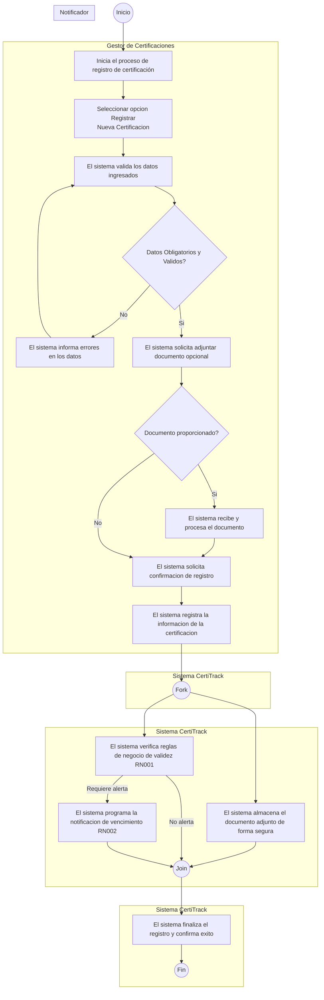

# Detalle de Casos de Uso

## Diagrama de Actividad: Registrar Nueva Certificación

```mermaid

graph TD
    start((Inicio)) --> A1

    subgraph Gestor de Certificaciones
        A1[Inicia el proceso de registro de certificación] --> A2
        A2[Seleccionar opcion Registrar<br/>Nueva Certificacion] --> A3
        A3[El sistema valida los datos ingresados] --> A4{Datos Obligatorios y Validos?}

        A4 -- No --> A5[El sistema informa errores en los datos]
        A5 --> A3

        A4 -- Si --> A6[El sistema solicita adjuntar documento opcional]

        A6 --> A7{Documento proporcionado?}
        A7 -- Si --> A8[El sistema recibe y procesa el documento]
        A8 --> A9[El sistema solicita confirmacion de registro]
        A7 -- No --> A9

        A9 --> B1
    end

    subgraph Sistema CertiTrack
        B1[El sistema registra la informacion de la certificacion] --> B_fork
    end

    B_fork(("Fork")) --> B2_left[El sistema almacena el documento adjunto de forma segura]
    B_fork --> B2_right[El sistema verifica reglas de negocio de validez RN001]

    subgraph Sistema CertiTrack
        B2_left --> B3_join
        B2_right -- No alerta --> B3_join
        B2_right -- Requiere alerta --> F1
    end

    subgraph Notificador
        F1[El sistema programa la notificacion de vencimiento RN002] --> B3_join
    end

    subgraph Sistema CertiTrack
        B3_join(("Join")) --> E1[El sistema finaliza el registro y confirma exito]
        E1 --> end_node
    end

    end_node((Fin))
```