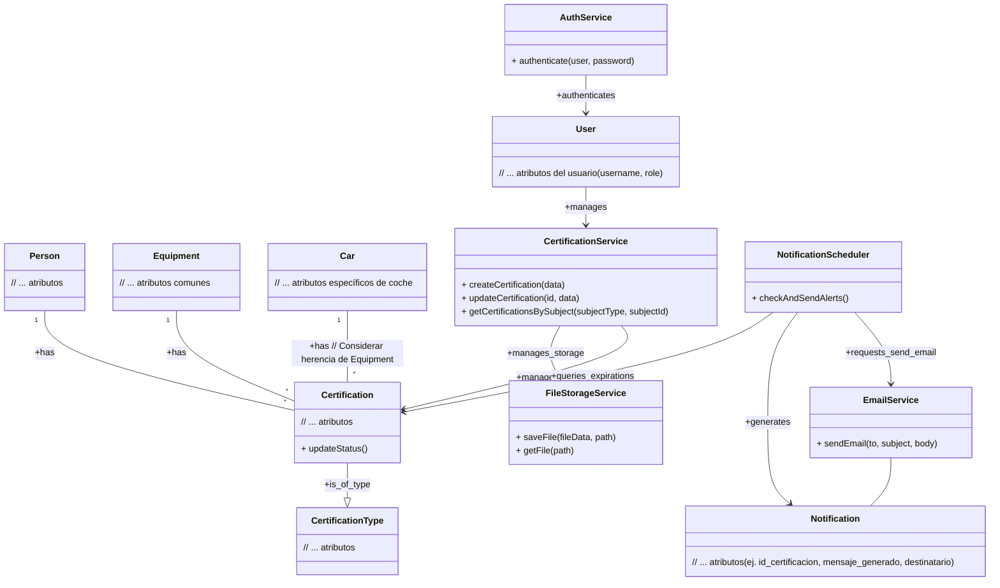

# Diagrama de Clases del Sistema de Gestión de Certificaciones

Este es el boceto del diagrama de clases que representa la arquitectura de la aplicación CertiTrack.

```mermaid
classDiagram
    class AuthService {
        + authenticate(user, password)
    }

    class User {
        // ... atributos del usuario (username, role)
    }

    class FileStorageService {
        + saveFile(fileData, path)
        + getFile(path)
    }

    class Person {
        // ... atributos
    }

    class Equipment {
        // ... atributos comunes
    }

    class Car {
        // ... atributos específicos de coche
    }

    class Certification {
        // ... atributos
        + updateStatus()
    }

    class CertificationType {
        // ... atributos
    }

    class Notification {
        // ... atributos (ej. id_certificacion, mensaje_generado, destinatario)
    }

    class EmailService {
        + sendEmail(to, subject, body)
    }

    class CertificationService {
        + createCertification(data)
        + updateCertification(id, data)
        + getCertificationsBySubject(subjectType, subjectId)
    }

    class NotificationScheduler {
        + checkAndSendAlerts()
    }


    AuthService --> User : +authenticates
    User --> CertificationService : +manages

    Person "1" -- "*" Certification : +has
    Equipment "1" -- "*" Certification : +has
    Car "1" -- "*" Certification : +has // Considerar herencia de Equipment

    Certification --|> CertificationType : +is_of_type

    CertificationService --> FileStorageService : +manages_storage
    CertificationService --> Certification : +manages

    NotificationScheduler --> Certification : +queries_expirations
    NotificationScheduler --> Notification : +generates
    NotificationScheduler --> EmailService : +requests_send_email
    EmailService -- Notification
``` 