# **Documento de Diseño del Sistema CertiTrack**

## **0. Introducción / Resumen Ejecutivo**

Este documento presenta la planificación y el diseño inicial del sistema **CertiTrack**, una aplicación web destinada a la gestión integral de certificaciones para personas y equipos dentro de una organización. El objetivo principal de CertiTrack es optimizar el seguimiento, control y notificación de las fechas de vencimiento de diversas certificaciones, garantizando el cumplimiento normativo y la disponibilidad de personal y equipos certificados.

El presente informe detalla la visión del proyecto, los requisitos funcionales y no funcionales, el diseño de la base de datos, la interfaz de usuario, la arquitectura del sistema, la definición de la API, la planificación de pruebas, la estrategia de implementación inicial, las consideraciones de seguridad en AWS, la gestión de riesgos y los roles del equipo. Este compendio sirve como una guía fundamental para el desarrollo del Producto Mínimo Viable (MVP) de CertiTrack, sentando las bases para futuras expansiones y adaptaciones a las necesidades específicas del cliente.

La implementación del MVP se enfocará en un despliegue optimizado en costos, utilizando una única instancia EC2 de AWS con Docker para contenerizar el front-end (React/Next.js), el back-end (Go con Gin y GORM) y la base de datos PostgreSQL, priorizando la eficiencia y la agilidad en la entrega.

## **1. Definición y Alcance del Proyecto**

**CertiTrack** es una aplicación web diseñada para llevar un control riguroso de las certificaciones de personas y equipos. Su objetivo principal es asegurar el cumplimiento normativo, la seguridad operativa y la gestión eficiente del talento y los activos, evitando vencimientos inesperados y facilitando la trazabilidad.

### **1.1. Requisitos de Negocio Clave (RN)**

* **RN001 - Gestión de Certificaciones:** El sistema debe permitir registrar, consultar, actualizar y eliminar certificaciones, asociándolas a personas o equipos. Debe incluir detalles como fecha de emisión, vencimiento y documentos adjuntos.  
* **RN002 - Sistema de Alertas y Notificaciones:** El sistema debe notificar proactivamente sobre certificaciones próximas a vencer o ya vencidas. Las notificaciones deben ser configurables y dirigidas a múltiples destinatarios según roles o reglas.  
* **RN003 - Gestión de Personas:** El sistema debe permitir registrar y gestionar el perfil de los empleados o personal, incluyendo sus datos de contacto y la relación con sus certificaciones.  
* **RN004 - Gestión de Equipos:** El sistema debe permitir registrar y gestionar los equipos, máquinas o activos que requieren certificaciones, incluyendo su número de activo y la relación con sus certificaciones.  
* **RN005 - Trazabilidad y Auditoría:** El sistema debe mantener un registro de las acciones clave y cambios en las certificaciones para fines de auditoría.  
* **RN006 - Reportes y Paneles de Control:** Proporcionar visualizaciones y reportes sobre el estado general de las certificaciones.

## **2. Casos de Uso (Diagramas de Actividad)**

Esta sección detalla los flujos de actividad para los casos de uso principales del sistema CertiTrack.

### **2.1. Registrar Nueva Certificación (UC_RegisterCert)**


### **2.2. Consultar y Filtrar Certificaciones (UC_QueryFilterCert)**


### **2.3. Ver Detalle y Documento de Certificación (UC_ViewCertDetail)**


### **2.4. Editar Certificación (UC_EditCert)**


### **2.5. Enviar Alertas de Vencimiento (UC_SendAlerts)**


### **2.6. Gestionar Personas (UC_ManagePersons)**


### **2.7. Gestionar Equipos (UC_ManageEquipment)**


## **3. Diseño de la Base de Datos (DER)**

La base de datos relacional **PostgreSQL** servirá como el núcleo de almacenamiento de datos.

### **3.1. Diagrama Entidad-Relación (DER_CertiTrack)**

```mermaid
erDiagram
    PERSONA {
        UUID id PK "Identificador unico de la persona"
        VARCHAR(255) nombre "Nombre de la persona"
        VARCHAR(255) apellido "Apellido de la persona"
        VARCHAR(50) identificacion "Identificacion unica de la persona (UNIQUE)"
        VARCHAR(255) correo_electronico "Correo electronico de la persona (UNIQUE)"
        VARCHAR(50) telefono "Numero de telefono de la persona"
        VARCHAR(20) estado "Estado actual de la persona (ACTIVO, INACTIVO, EGRESADO)"
        TIMESTAMP fecha_creacion "Marca de tiempo de creacion"
        TIMESTAMP fecha_actualizacion "Marca de tiempo de ultima actualizacion"
    }

    EQUIPO {
        UUID id PK "Identificador unico del equipo"
        VARCHAR(255) nombre_equipo "Nombre del equipo o activo"
        VARCHAR(255) numero_activo "Numero de identificacion del activo del equipo (UNIQUE)"
        TEXT descripcion "Descripcion del equipo"
        UUID id_responsable_persona FK "Persona responsable del equipo"
        VARCHAR(20) estado "Estado actual del equipo (ACTIVO, DADO_DE_BAJA, EN_MANTENIMIENTO)"
        TIMESTAMP fecha_creacion "Marca de tiempo de creacion"
        TIMESTAMP fecha_actualizacion "Marca de tiempo de ultima actualizacion"
    }

    TIPO_CERTIFICACION {
        UUID id PK "Identificador unico del tipo de certificacion"
        VARCHAR(255) nombre_tipo "Nombre del tipo de certificacion (UNIQUE)"
        TEXT descripcion "Descripcion del tipo de certificacion"
        VARCHAR(20) estado "Estado del tipo de certificacion (ACTIVO, INACTIVO)"
        TIMESTAMP fecha_creacion "Marca de tiempo de creacion"
        TIMESTAMP fecha_actualizacion "Marca de tiempo de ultima actualizacion"
    }

    CERTIFICACION {
        UUID id PK "Identificador unico de la certificacion"
        VARCHAR(255) nombre_certificacion "Nombre especifico de la certificacion obtenida"
        UUID id_tipo_certificacion FK "Tipo de certificacion al que pertenece"
        VARCHAR(20) asociado_a_tipo "Indica si la certificacion es de una (PERSONA, EQUIPO)"
        UUID asociado_a_id "ID de la persona o equipo al que esta asociada la certificacion"
        VARCHAR(255) codigo_certificacion "Codigo o numero de referencia de la certificacion (UNIQUE)"
        DATE fecha_emision "Fecha de emision de la certificacion"
        DATE fecha_vencimiento "Fecha de vencimiento de la certificacion"
        VARCHAR(30) estado "Estado actual de la certificacion (ACTIVA, VENCIDA, PROXIMA_A_VENCER, CANCELADA, EXPIRADA_EXTERNAMENTE)"
        TIMESTAMP fecha_creacion "Marca de tiempo de creacion"
        TIMESTAMP fecha_actualizacion "Marca de tiempo de ultima actualizacion"
    }

    ATRIBUTO_ADICIONAL_CERTIFICACION {
        UUID id PK "Identificador unico del atributo adicional"
        UUID id_certificacion FK "ID de la certificacion a la que pertenece el atributo"
        VARCHAR(255) nombre_atributo "Nombre del atributo (ej. 'Institucion Emisora', 'Horas de Curso')"
        TEXT valor_atributo "Valor del atributo"
        TIMESTAMP fecha_creacion "Marca de tiempo de creacion"
        TIMESTAMP fecha_actualizacion "Marca de tiempo de ultima actualizacion"
    }

    DOCUMENTO_ADJUNTO {
        UUID id PK "Identificador unico del documento"
        UUID id_certificacion FK "ID de la certificacion a la que se adjunta el documento"
        VARCHAR(255) nombre_archivo "Nombre original del archivo"
        VARCHAR(255) ruta_almacenamiento "Ruta fisica o URL del archivo almacenado (UNIQUE)"
        VARCHAR(50) tipo_mime "Tipo MIME del archivo (ej. application/pdf)"
        BIGINT tamano_bytes "Tamaño del archivo en bytes"
        TIMESTAMP fecha_subida "Fecha y hora de subida del documento"
        TIMESTAMP fecha_actualizacion "Marca de tiempo de ultima actualizacion"
    }

    ALERTA_NOTIFICACION {
        UUID id PK "Identificador unico de la notificacion"
        VARCHAR(30) tipo_alerta "Tipo de alerta disparada (VENCIMIENTO_PROXIMO, VENCIMIENTO_HOY, VENCIDA, OTRO)"
        UUID id_certificacion FK "ID de la certificacion asociada a la alerta"
        TIMESTAMP fecha_programada "Fecha y hora en que la alerta fue programada para envio"
        TIMESTAMP fecha_envio_general "Fecha y hora real del intento de envio general"
        VARCHAR(30) estado_general "Estado general del envio de la notificacion (PENDIENTE, ENVIADA_PARCIAL, ENVIADA_COMPLETA, FALLIDA)"
        TEXT mensaje_personalizado "Mensaje opcional personalizado para la alerta"
        TIMESTAMP fecha_creacion "Marca de tiempo de creacion"
    }

    ALERTA_DESTINATARIO {
        UUID id PK "Identificador unico del destinatario de la notificacion"
        UUID id_alerta_notificacion FK "ID de la notificacion a la que pertenece este destinatario"
        UUID id_persona FK  "ID de la persona destinataria (si aplica)"
        VARCHAR(255) correo_electronico_personalizado "Correo electronico si no es una persona del sistema"
        VARCHAR(30) tipo_destinatario "Rol o tipo de destinatario (PRINCIPAL, JEFE_UNIDAD, RESPONSABLE_EQUIPO, OTRO)"
        VARCHAR(20) estado_envio "Estado individual del envio al destinatario (PENDIENTE, ENVIADO, FALLIDO)"
        TEXT detalle_error "Mensaje de error si el envio fallo"
        TIMESTAMP fecha_envio_individual "Fecha y hora del intento de envio individual"
        TIMESTAMP fecha_actualizacion "Marca de tiempo de ultima actualizacion"
    }

    REGLA_ALERTA {
        UUID id PK "Identificador unico de la regla de alerta"
        UUID id_tipo_certificacion FK "Tipo de certificacion a la que aplica esta regla"
        VARCHAR(30) tipo_alerta "Tipo de alerta que dispara la regla (VENCIMIENTO_PROXIMO, VENCIMIENTO_HOY, VENCIDA, OTRO)"
        INTEGER dias_antes_vencimiento "Numero de dias antes del vencimiento para disparar la alerta"
        TEXT descripcion "Descripcion de la regla"
        BOOLEAN activa "Indica si la regla esta activa o inactiva"
        TIMESTAMP fecha_creacion "Marca de tiempo de creacion"
        TIMESTAMP fecha_actualizacion "Marca de tiempo de ultima actualizacion"
    }

    REGLA_ALERTA_DESTINATARIO_CONFIG {
        UUID id PK "Identificador unico de la configuracion de destinatario"
        UUID id_regla_alerta FK "ID de la regla de alerta a la que pertenece esta configuracion"
        VARCHAR(30) tipo_destinatario_config "Tipo de destinatario a notificar (PERSONA_CERTIFICADA, RESPONSABLE_EQUIPO, CORREO_ESPECIFICO, ROL_SISTEMA)"
        VARCHAR(255) valor_configuracion "Valor asociado al tipo (ej. un correo especifico, un nombre de rol)"
        TIMESTAMP fecha_creacion "Marca de tiempo de creacion"
        TIMESTAMP fecha_actualizacion "Marca de tiempo de ultima actualizacion"
    }

    PERSONA ||--o{ CERTIFICACION : "asociado_a_id"
    EQUIPO ||--o{ CERTIFICACION : "asociado_a_id"
    PERSONA ||--o{ EQUIPO : "id_responsable_persona"
    TIPO_CERTIFICACION ||--o{ CERTIFICACION : "id_tipo_certificacion"
    CERTIFICACION ||--o{ ATRIBUTO_ADICIONAL_CERTIFICACION : "id_certificacion"
    CERTIFICACION ||--o{ DOCUMENTO_ADJUNTO : "id_certificacion"
    CERTIFICACION ||--o{ ALERTA_NOTIFICACION : "id_certificacion"
    ALERTA_NOTIFICACION ||--o{ ALERTA_DESTINATARIO : "id_alerta_notificacion"
    PERSONA ||--o{ ALERTA_DESTINATARIO : "id_persona"
    TIPO_CERTIFICACION ||--o{ REGLA_ALERTA : "id_tipo_certificacion"
    REGLA_ALERTA ||--o{ REGLA_ALERTA_DESTINATARIO_CONFIG : "id_regla_alerta"
```



### **3.2. Decisiones Clave de Diseño de Base de Datos**

* **Gestión de Registros (Soft Delete):** Se implementa la "eliminación lógica" para Persona, Equipo y Certificacion. Los registros se marcan con un estado (INACTIVO, DADO_DE_BAJA, CANCELADA) en lugar de ser eliminados físicamente, preservando la integridad referencial y el historial.  
* **Manejo de Asociaciones de Certificaciones (Asociación Polimórfica):** La tabla CERTIFICACION utiliza asociado_a_tipo (ENUM: 'PERSONA', 'EQUIPO') y asociado_a_id (UUID) para vincularse a PERSONA o EQUIPO. Esto proporciona flexibilidad y extensibilidad, con la lógica de integridad referencial manejada a nivel de aplicación.  
* **Manejo de Datos Adicionales/Atributos Específicos de Certificación:** La tabla ATRIBUTO_ADICIONAL_CERTIFICACION almacena atributos variables por certificación (clave-valor), permitiendo flexibilidad sin modificar el esquema principal de CERTIFICACION.  
* **Gestión de Múltiples Destinatarios para Notificaciones:** La tabla ALERTA_DESTINATARIO permite asociar múltiples direcciones de correo electrónico a una única instancia de ALERTA_NOTIFICACION, registrando el estado de envío individual para cada uno.

## **4. Diseño de la Interfaz de Usuario (UI)**

El sistema CertiTrack contará con una interfaz de usuario intuitiva y consistente, diseñada para facilitar la gestión de certificaciones.

### **4.1. Dashboard (Panel de Control Principal)**

**Nombre del Diagrama:** UI_PanelPrincipal

Muestra un resumen ejecutivo del estado de las certificaciones, personas y equipos.


### **4.2. Listado de Certificaciones**

**Nombre del Diagrama:** UI_ListaCertificaciones

Permite buscar, filtrar y gestionar certificaciones.


### **4.3. Formulario de Certificación (Registro, Detalle y Edición)**

**Nombre del Diagrama:** UI_FormularioCertificacion

Permite crear, ver detalles o editar una certificación.


### **4.4. Listado de Personas**

**Nombre del Diagrama:** UI_ListaPersonas

Permite buscar, filtrar y gestionar personas.


### **4.5. Formulario de Persona (Registro, Detalle y Edición)**

**Nombre del Diagrama:** UI_FormularioPersona

Permite crear, ver detalles o editar una persona.


### **4.6. Listado de Equipos**

**Nombre del Diagrama:** UI_ListaEquipos

Permite buscar, filtrar y gestionar equipos.


### **4.7. Formulario de Equipo (Registro, Detalle y Edición)**

**Nombre del Diagrama:** UI_FormularioEquipo

Permite crear, ver detalles o editar un equipo.


### **4.8. Listado de Alertas/Notificaciones**

**Nombre del Diagrama:** UI_ListaAlertas

Proporciona una vista tabular de todas las alertas generadas por el sistema.


### **4.9. Detalle de Alerta/Notificación**

**Nombre del Diagrama:** UI_DetalleAlerta

Muestra todos los detalles de una alerta específica y sus destinatarios individuales.


### **4.10. Listado de Reglas de Alerta**

**Nombre del Diagrama:** UI_ListaReglasAlerta

Muestra una tabla de todas las reglas de alerta configuradas en el sistema.


### **4.11. Formulario de Regla de Alerta (Registro y Edición)**

**Nombre del Diagrama:** UI_FormularioReglaAlerta

Permite crear o editar una regla específica para la generación y envío de alertas.

```mermaid
graph TD  
    subgraph "UI_FormularioReglaAlerta (Registro - Edicion)"  
        A[Barra de Navegacion Superior-Lateral] --> B(Logo, Enlaces, Menu Usuario)

        subgraph "Contenido Principal del Formulario"  
            C[Titulo Dinamico: Registrar-Editar Regla de Alerta]

            subgraph "Seccion Criterios de la Regla"  
                C1[Campo: Tipo de Certificacion* - Dropdown]  
                C2[Campo: Tipo de Alerta* - Dropdown]  
                C3[Campo: Dias Antes del Vencimiento* - Numero]  
                C4[Campo: Descripcion de la Regla - Textarea]  
                C5[Checkbox: Activa]  
            end

            subgraph "Seccion Configuracion de Destinatarios"  
                D[Subtitulo: Destinatarios de la Notificacion]  
                D0[Instrucciones: Añada quien recibira la alerta]

                subgraph "Lista de Destinatarios Configurados"  
                    D1[Tabla-Lista] --> D1a(Encabezados: Tipo Destinatario, Valor-Correo, Acciones)  
                    D1 --> D1b(Filas: Destinatario 1, Destinatario 2, ...)  
                end

                subgraph "Interfaz para Añadir Destinatarios"  
                    D2[Dropdown: Añadir Destinatario por Tipo]  
                    D2a{Campo: Entrada de Valor - Condicional ej. Correo Especifico}  
                    D3[Boton: Añadir Destinatario]  
                end  
            end

            subgraph "Seccion Acciones del Formulario"  
                F1[Boton: Guardar Regla]  
                F2[Boton: Cancelar]  
            end  
        end  
    end
```



### **4.12. Listado de Tipos de Certificación**

**Nombre del Diagrama:** UI_ListaTiposCertificacion

Permite ver, buscar y gestionar los tipos de certificación.


### **4.13. Formulario de Tipo de Certificación (Registro y Edición)**

**Nombre del Diagrama:** UI_FormularioTipoCertificacion

Permite crear nuevos tipos de certificación o modificar los existentes.

```mermaid
graph TD  
    subgraph "UI_FormularioTipoCertificacion (Registro - Edicion)"  
        A[Barra de Navegacion Superior-Lateral] --> B(Logo, Enlaces, Menu Usuario)

        subgraph "Contenido Principal del Formulario"  
            C[Titulo Dinamico: Registrar-Editar Tipo de Certificacion]

            subgraph "Seccion Datos del Tipo de Certificacion"  
                C1[Campo: Nombre del Tipo* - Texto]  
                C2[Campo: Descripcion - Textarea]  
                C3[Campo: Estado - Dropdown --Edicion-Detalle--]  
            end

            subgraph "Seccion Acciones del Formulario"  
                F1[Boton: Guardar Tipo - Guardar Cambios]  
                F2[Boton: Cancelar]  
            end  
        end  
    end
```

## **5. Arquitectura del Sistema (Visión de Alto Nivel)**

**Objetivo:** Definir la estructura general de CertiTrack, identificando los componentes principales, sus responsabilidades y cómo interactúan entre sí.

### **5.1. Modelo General: Arquitectura en Capas y Componentes Clave**

Proponemos una **arquitectura de tres capas** para CertiTrack, que separa responsabilidades para facilitar el desarrollo, mantenimiento y escalabilidad.

1. **Capa de Presentación (Front-end):** Interacción directa con el usuario, UI.  
2. **Capa de Lógica de Negocio (Back-end / API):** Contiene la lógica central, procesa solicitudes, valida datos, gestiona seguridad y notificaciones.  
3. **Capa de Datos (Base de Datos y Almacenamiento):** Almacenamiento persistente de toda la información.

Además, se consideran un **Servicio de Notificaciones Externo** y, opcionalmente, **Servicios de Autenticación/Autorización externos**.

### **5.2. Diagrama de Arquitectura de Componentes de Alto Nivel**

**Nombre del Diagrama:** ARQ_Componentes_AltoNivel

```mermaid
graph LR  
    subgraph "Cliente"  
        Navegador[Navegador Web / Aplicacion Web]  
    end

    subgraph "Capa de Presentacion (Front-end)"  
        UI[Interfaz de Usuario CertiTrack] -- HTTP/HTTPS (REST API) --> LND[API REST de Logica de Negocio]  
    end

    subgraph "Capa de Logica de Negocio (Back-end)"  
        LND[API REST de Logica de Negocio]  
        BDL(Modulo de Base de Datos - ORM)  
        MN(Motor de Notificaciones)  
        SEG(Modulo de Seguridad - Autenticacion-Autorizacion)

        LND --> BDL  
        LND --> MN  
        LND --> SEG  
        MN --> SES[Servicio Externo de Notificaciones: Email-SMS]  
    end

    subgraph "Capa de Datos"  
        DB(Base de Datos PostgreSQL)  
        FS[Almacenamiento de Ficheros - Documentos]

        BDL --> DB  
        BDL --> FS  
    end

    style Navegador fill:#E0BBE4,stroke:#333,stroke-width:2px  
    style UI fill:#957DAD,stroke:#333,stroke-width:2px  
    style LND fill:#D291BC,stroke:#333,stroke-width:2px  
    style BDL fill:#D291BC,stroke:#333,stroke-width:2px  
    style MN fill:#D291BC,stroke:#333,stroke-width:2px  
    style SEG fill:#D291BC,stroke:#333,stroke-width:2px  
    style DB fill:#FFC72C,stroke:#333,stroke-width:2px  
    style FS fill:#FFC72C,stroke:#333,stroke-width:2px  
    style SES fill:#FF6B6B,stroke:#333,stroke-width:2px
```

### **5.3. Consideraciones Tecnológicas (Stack de Desarrollo Propuesto)**

Para CertiTrack, podemos considerar un stack de tecnologías moderno y robusto:

* **Front-end (Capa de Presentación):**  
  * **Framework:** **ReactJS** / Nextjs.  
  * **Lenguaje:** JavaScript / TypeScript.  
  * **Herramientas:** PNPM para gestión de paquetes, Vite para bundling.  
* **Back-end (Capa de Lógica de Negocio):**  
  * **Lenguaje:** **GO** (con el framework **Gin Gonic**).  
  * **Alternativas:** Node.js (con Express).  
* **Base de Datos (Capa de Datos):**  
  * **Sistema de Gestión de Base de Datos (SGBD):** **PostgreSQL**.  
  * **ORM (Object-Relational Mapper):** GORM (para Go) o Sequelize (para Node.js).  
  * **Almacenamiento de Ficheros:** Amazon S3, Google Cloud Storage, Azure Blob Storage (para soluciones en la nube) o un servidor de ficheros en el propio servidor si es on-premise.  
* **Servicios de Notificaciones Externos:**  
  * **Email:** Un servicio SMTP (como SendGrid, Mailgun, Amazon SES). 
  * **SMS (si aplica):** Proveedores como Twilio.  
* **Despliegue / Infraestructura:**  
  * **Plataformas Cloud:** AWS, Google Cloud Platform (GCP), Microsoft Azure.  
  * **Contenerización:** Docker.  
  * **Orquestación:** Kubernetes (si es necesario para gran escala).

## **6. Definición de APIs**

Esta sección detalla la especificación de la API RESTful para el sistema CertiTrack.

### **6.1. Principios de Diseño de API REST**

Nuestra API seguirá los principios REST (Representational State Transfer):

* **Sin Estado (Stateless):** Cada solicitud del cliente al servidor contiene toda la información necesaria para que el servidor la procese, sin depender de sesiones previas en el servidor.  
* **Basada en Recursos:** La API se centrará en los recursos (Certificaciones, Personas, Equipos, Alertas, etc.) y las operaciones que se pueden realizar sobre ellos.  
* **Uso de Métodos HTTP Estándar:** Utilizaremos los métodos HTTP (GET, POST, PUT, DELETE) para indicar la acción deseada sobre un recurso.  
* **JSON como Formato de Intercambio:** Todos los datos enviados y recibidos estarán en formato JSON (JavaScript Object Notation), que es ligero y ampliamente compatible.

### **6.2. Estructura General de Endpoints**

La base para todos los endpoints será una URL clara y versionada para futuras expansiones. Proponemos /api/v1/.

**Patrón General:**
  ```http
  [MÉTODO HTTP] /api/v1/[recurso_principal]/[id_recurso_principal]/[sub_recurso]/[id_sub_recurso]
  ```

### **6.3. Endpoints Clave por Entidad (Ejemplos Detallados)**

Aquí se presentan los endpoints principales para las entidades que hemos definido, incluyendo las operaciones CRUD (Crear, Leer, Actualizar, Eliminar) y otras acciones específicas.

#### **6.3.1. Autenticación y Autorización**

* **POST /api/v1/auth/login/**  
  * **Descripción:** Autenticar a un usuario y obtener un token de acceso.  
  * **Cuerpo de Solicitud:**  
  ```json
    {  
      "username": "nombre_usuario",  
      "password": "contraseña_segura"  
    }
    ```

  * **Cuerpo de Respuesta (200 OK):** 
    ```json 
    {  
      "access_token": "eyJhbGciOiJIUzI1Ni...",  
      "refresh_token": "eyJhbGciOiJIUzI1Ni..."  
    }
    ```
* **POST /api/v1/auth/refresh/**  
  * **Descripción:** Refrescar un token de acceso usando un token de refresco expirado o próximo a expirar.  
  * **Cuerpo de Solicitud:**
    ```json  
    {  
      "refresh_token": "eyJhbGciOiJIUzI1Ni..."  
    }
    ```
  * **Cuerpo de Respuesta (200 OK):**  
    ```json
    {  
      "access_token": "eyJhbGciOiJIUzI1Ni..."  
    }
    ```

* **(Opcional) POST /api/v1/auth/logout/**  
  * **Descripción:** Invalidar un token de sesión o un token de refresco específico.  
  * **Cuerpo de Solicitud:**
  ```json 
  { "refresh_token": "..." } 
  ```
  (o vacío si se invalida el token actual).  
  * **Cuerpo de Respuesta (200 OK):** 
  ```json
  { "message": "Sesion cerrada exitosamente." }
  ```

#### **6.3.2. Certificaciones**

* **GET /api/v1/certificaciones/**  
  * **Descripción:** Obtener una lista paginada de certificaciones. Permite filtrar por parámetros de consulta.  
  * **Parámetros de Consulta (Ejemplos):**  
    * ?tipo_id=uuid-tipo-abc  
    * ?estado=ACTIVA  
    * ?asociado_a_tipo=PERSONA&asociado_a_id=uuid-persona-123  
    * ?fecha_vencimiento_antes=2025-12-31  
    * ?buscar=primeros%20auxilios (búsqueda por nombre, código, etc.)  
    * ?pagina=2&limite=10 (paginación)  
  * **Cuerpo de Respuesta (200 OK):**  
    ```json
    {  
      "total": 150,  
      "pagina": 1,  
      "limite": 10,  
      "resultados": [  
        {  
          "id": "uuid-cert-001",  
          "nombre_certificacion": "Certificacion de Primeros Auxilios",  
          "id_tipo_certificacion": "uuid-tipo-pa",  
          "asociado_a_tipo": "PERSONA",  
          "asociado_a_id": "uuid-persona-001",  
          "codigo_certificacion": "PA-2023-001",  
          "fecha_emision": "2023-01-15",  
          "fecha_vencimiento": "2025-01-15",  
          "estado": "ACTIVA",  
          "fecha_creacion": "2023-01-10T10:00:00Z",  
          "fecha_actualizacion": "2024-05-20T14:30:00Z"  
        },  
        {  
          "id": "uuid-cert-002",  
          "nombre_certificacion": "Calibracion Amperimetro XYZ",  
          "id_tipo_certificacion": "uuid-tipo-calib",  
          "asociado_a_tipo": "EQUIPO",  
          "asociado_a_id": "uuid-equipo-001",  
          "codigo_certificacion": "CAL-2024-005",  
          "fecha_emision": "2024-03-01",  
          "fecha_vencimiento": "2025-03-01",  
          "estado": "ACTIVA",  
          "fecha_creacion": "2024-02-28T09:00:00Z",  
          "fecha_actualizacion": "2024-03-01T11:00:00Z"  
        }  
      ]  
    }
    ```

* **GET /api/v1/certificaciones/{id}/**  
  * **Descripción:** Obtener los detalles completos de una certificación específica.  
  * **Parámetros de Ruta:** id (UUID de la certificación).  
  * **Cuerpo de Respuesta (200 OK):**  
    ```json
    {  
      "id": "uuid-cert-001",  
      "nombre_certificacion": "Certificacion de Primeros Auxilios",  
      "id_tipo_certificacion": "uuid-tipo-pa",  
      "asociado_a_tipo": "PERSONA",  
      "asociado_a_id": "uuid-persona-001",  
      "codigo_certificacion": "PA-2023-001",  
      "fecha_emision": "2023-01-15",  
      "fecha_vencimiento": "2025-01-15",  
      "estado": "ACTIVA",  
      "fecha_creacion": "2023-01-10T10:00:00Z",  
      "fecha_actualizacion": "2024-05-20T14:30:00Z",  
      "documentos_adjuntos": [  
        {  
          "id": "uuid-doc-001",  
          "nombre_archivo": "certificado_pa_juan.pdf",  
          "ruta_almacenamiento": "https://storage.certitrack.com/docs/uuid-doc-001.pdf",  
          "tipo_mime": "application/pdf",  
          "tamano_bytes": 102400,  
          "fecha_subida": "2023-01-15T16:00:00Z"  
        }  
      ],  
      "atributos_adicionales": [  
        {  
          "id": "uuid-attr-001",  
          "nombre_atributo": "Institucion Emisora",  
          "valor_atributo": "Cruz Roja Internacional"  
        },  
        {  
          "id": "uuid-attr-002",  
          "nombre_atributo": "Horas de Curso",  
          "valor_atributo": "40"  
        }  
      ]  
    }
    ```

* **POST /api/v1/certificaciones/**  
  * **Descripción:** Crear una nueva certificación.  
  * **Cuerpo de Solicitud:**  
    ```json
    {  
      "nombre_certificacion": "Certificacion de Liderazgo",  
      "id_tipo_certificacion": "uuid-tipo-liderazgo",  
      "asociado_a_tipo": "PERSONA",  
      "asociado_a_id": "uuid-persona-002",  
      "codigo_certificacion": "LID-2024-010",  
      "fecha_emision": "2024-04-01",  
      "fecha_vencimiento": "2026-04-01",  
      "estado": "ACTIVA",  
      "atributos_adicionales": [  
        { "nombre_atributo": "Plataforma", "valor_atributo": "Coursera" }  
      ]  
    }
    ```

  * **Cuerpo de Respuesta (201 Created):** Objeto Certificacion creado con su id asignado y los campos generados por el servidor (ej. fecha_creacion).  
    ```json
    {  
      "id": "uuid-cert-003",  
      "nombre_certificacion": "Certificacion de Liderazgo",  
      "id_tipo_certificacion": "uuid-tipo-liderazgo",  
      "asociado_a_tipo": "PERSONA",  
      "asociado_a_id": "uuid-persona-002",  
      "codigo_certificacion": "LID-2024-010",  
      "fecha_emision": "2024-04-01",  
      "fecha_vencimiento": "2026-04-01",  
      "estado": "ACTIVA",  
      "fecha_creacion": "2024-07-05T15:00:00Z",  
      "fecha_actualizacion": "2024-07-05T15:00:00Z",  
      "atributos_adicionales": [  
        { "nombre_atributo": "Plataforma", "valor_atributo": "Coursera" }  
      ]  
    }
    ```

* **PUT /api/v1/certificaciones/{id}/**  
  * **Descripción:** Actualizar completamente una certificación existente. Requiere que se envíen todos los campos de la certificación, incluso si no han cambiado.  
  * **Parámetros de Ruta:** id.  
  * **Cuerpo de Solicitud:** Objeto Certificacion con todos los datos actualizados.  
  * **Cuerpo de Respuesta (200 OK):** Objeto Certificacion actualizado.
    ```json  
    {  
      "id": "uuid-cert-001",  
      "nombre_certificacion": "Certificacion de Primeros Auxilios (Actualizada)",  
      "id_tipo_certificacion": "uuid-tipo-pa",  
      "asociado_a_tipo": "PERSONA",  
      "asociado_a_id": "uuid-persona-001",  
      "codigo_certificacion": "PA-2023-001-REV",  
      "fecha_emision": "2023-01-15",  
      "fecha_vencimiento": "2026-01-15",  
      "estado": "ACTIVA",  
      "fecha_creacion": "2023-01-10T10:00:00Z",  
      "fecha_actualizacion": "2024-07-05T16:00:00Z"  
    }
    ```

* **PATCH /api/v1/certifications/{id}/**  
  * **Descripción:** Update an existing certification partially. Only send the fields that need to be updated.  
  * **Path Parameters:** id.  
  * **Request Body:** Object with only the fields to update.  
  * **Response Body (200 OK):** Updated Certification object. 
    ```json 
    {  
      "id": "uuid-cert-001",  
      "status": "EXPIRED",  
      "updated_at": "2024-07-05T12:00:00Z",  
      "certification_name": "First Aid Certification",  
      "certification_type_id": "uuid-type-pa",  
      "associated_type": "PERSON",  
      "associated_id": "uuid-person-001",  
      "certification_code": "PA-2023-001",  
      "issue_date": "2023-01-15",  
      "expiration_date": "2025-01-15",  
      "created_at": "2023-01-10T10:00:00Z"  
    }
    ```

* **DELETE /api/v1/certifications/{id}/**  
  * **Description:** Soft delete a certification (change its status to 'CANCELLED' or 'INACTIVE').  
  * **Path Parameters:** id.  
  * **Response Body (200 OK):**  
    ```json
    {  
      "message": "Certificacion actualizada a estado CANCELADA."  
    }
    ```

#### **6.3.3. Documentos Adjuntos de Certificación**

* **POST /api/v1/certificaciones/{id}/documentos/**  
  * **Descripción:** Subir un nuevo documento adjunto para una certificación.  
  * **Parámetros de Ruta:** id (ID de la certificación).  
  * **Cuerpo de Solicitud:** multipart/form-data con el archivo y opcionalmente metadatos (ej. nombre_archivo_original).  
  * **Cuerpo de Respuesta (201 Created):** 
    ```json 
    {  
      "id": "uuid-doc-003",  
      "id_certificacion": "uuid-cert-001",  
      "nombre_archivo": "nuevo_documento.pdf",  
      "ruta_almacenamiento": "https://storage.certitrack.com/docs/uuid-doc-003.pdf",  
      "tipo_mime": "application/pdf",  
      "tamano_bytes": 51200,  
      "fecha_subida": "2024-07-05T10:00:00Z"  
    }
    ```

* **GET /api/v1/certificaciones/{cert_id}/documentos/{doc_id}/**  
  * **Descripción:** Descargar un documento adjunto específico.  
  * **Parámetros de Ruta:** cert_id, doc_id.  
  * **Cuerpo de Respuesta (200 OK):** El contenido binario del archivo (se enviará con el Content-Type adecuado).  
* **DELETE /api/v1/certificaciones/{cert_id}/documentos/{doc_id}/**  
  * **Descripción:** Eliminar un documento adjunto (lógicamente o físicamente, según la implementación de almacenamiento y políticas de retención).  
  * **Parámetros de Ruta:** cert_id, doc_id.  
  * **Cuerpo de Respuesta (200 OK):** { "message": "Documento eliminado exitosamente." }

#### **6.3.4. Personas**

* **GET /api/v1/personas/**  
  * **Descripción:** Obtener una lista paginada de personas.  
  * **Parámetros de Consulta (Ejemplos):** ?nombre=juan&estado=ACTIVO&pagina=1  
  * **Cuerpo de Respuesta (200 OK):** Lista de objetos Persona.  
* **GET /api/v1/personas/{id}/**  
  * **Descripción:** Obtener los detalles de una persona específica.  
  * **Parámetros de Ruta:** id.  
  * **Cuerpo de Respuesta (200 OK):** Objeto Persona completo.  
* **POST /api/v1/personas/**  
  * **Descripción:** Crear una nueva persona.  
  * **Cuerpo de Solicitud:** Objeto Persona (sin ID).  
  * **Cuerpo de Respuesta (201 Created):** Objeto Persona creado con ID.  
* **PUT /api/v1/personas/{id}/**  
  * **Descripción:** Actualizar completamente una persona existente.  
  * **Parámetros de Ruta:** id.  
  * **Cuerpo de Solicitud:** Objeto Persona con datos actualizados.  
  * **Cuerpo de Respuesta (200 OK):** Objeto Persona actualizado.  
* **PATCH /api/v1/personas/{id}/**  
  * **Descripción:** Actualizar parcialmente una persona existente.  
  * **Parámetros de Ruta:** id.  
  * **Cuerpo de Solicitud:** Objeto con campos a actualizar.  
  * **Cuerpo de Respuesta (200 OK):** Objeto Persona actualizado.  
* **DELETE /api/v1/personas/{id}/**  
  * **Descripción:** Eliminar lógicamente una persona (cambiar su estado a 'INACTIVO' o 'EGRESADO').  
  * **Parámetros de Ruta:** id.  
  * **Cuerpo de Respuesta (200 OK):** { "message": "Persona actualizada a estado INACTIVO." }  
* **GET /api/v1/personas/{id}/certificaciones/**  
  * **Descripción:** Obtener una lista de certificaciones asociadas a una persona específica.  
  * **Parámetros de Ruta:** id.  
  * **Cuerpo de Respuesta (200 OK):** Lista de objetos Certificacion (filtradas por asociado_a_tipo='PERSONA' y asociado_a_id={id}).

#### **6.3.5. Equipos**

* **GET /api/v1/equipos/**  
  * **Descripción:** Obtener una lista paginada de equipos.  
  * **Parámetros de Consulta (Ejemplos):** ?nombre=amperimetro&estado=ACTIVO  
  * **Cuerpo de Respuesta (200 OK):** Lista de objetos Equipo.  
* **GET /api/v1/equipos/{id}/**  
  * **Descripción:** Obtener los detalles de un equipo específico.  
  * **Parámetros de Ruta:** id.  
  * **Cuerpo de Respuesta (200 OK):** Objeto Equipo completo.  
* **POST /api/v1/equipos/**  
  * **Descripción:** Crear un nuevo equipo.  
  * **Cuerpo de Solicitud:** Objeto Equipo (sin ID).  
  * **Cuerpo de Respuesta (201 Created):** Objeto Equipo creado con ID.  
* **PUT /api/v1/equipos/{id}/**  
  * **Descripción:** Actualizar completamente un equipo existente.  
  * **Parámetros de Ruta:** id.  
  * **Cuerpo de Solicitud:** Objeto Equipo con datos actualizados.  
  * **Cuerpo de Respuesta (200 OK):** Objeto Equipo actualizado.  
* **PATCH /api/v1/equipos/{id}/**  
  * **Descripción:** Actualizar parcialmente un equipo existente.  
  * **Parámetros de Ruta:** id.  
  * **Cuerpo de Solicitud:** Objeto con campos a actualizar.  
  * **Cuerpo de Respuesta (200 OK):** Objeto Equipo actualizado.  
* **DELETE /api/v1/equipos/{id}/**  
  * **Descripción:** Eliminar lógicamente un equipo (cambiar su estado a 'DADO_DE_BAJA').  
  * **Parámetros de Ruta:** id.  
  * **Cuerpo de Respuesta (200 OK):** { "message": "Equipo actualizado a estado DADO_DE_BAJA." }  
* **GET /api/v1/equipos/{id}/certificaciones/**  
  * **Descripción:** Obtener una lista de certificaciones asociadas a un equipo específico.  
  * **Parámetros de Ruta:** id.  
  * **Cuerpo de Respuesta (200 OK):** Lista de objetos Certificacion (filtradas por asociado_a_tipo='EQUIPO' y asociado_a_id={id}).

#### **6.3.6. Alertas y Notificaciones**

* **GET /api/v1/alertas/**  
  * **Descripción:** Obtener una lista paginada del historial de alertas generadas.  
  * **Parámetros de Consulta (Ejemplos):** ?estado_general=FALLIDA&fecha_programada_despues=2024-01-01  
  * **Cuerpo de Respuesta (200 OK):** Lista de objetos AlertaNotificacion.  
* **GET /api/v1/alertas/{id}/**  
  * **Descripción:** Obtener los detalles de una alerta específica, incluyendo la lista de sus AlertaDestinatarios.  
  * **Parámetros de Ruta:** id.  
  * **Cuerpo de Respuesta (200 OK):** Objeto AlertaNotificacion con un array destinatarios anidado.  
* **POST /api/v1/alertas/{id}/reenviar/**  
  * **Descripción:** Reenviar una alerta existente a sus destinatarios.  
  * **Parámetros de Ruta:** id.  
  * **Cuerpo de Solicitud (Opcional):**  
    ```json
    {  
      "reenviar_fallidos_solamente": true,  // Si es true, solo reintenta los que fallaron o están pendientes  
      "destinatarios_ids": ["uuid-dest-001", "uuid-dest-002"] // Opcional, para reenviar a destinatarios específicos  
    }
    ```

  * **Cuerpo de Respuesta (200 OK):**
    ```json
    { "message": "Proceso de reenvio iniciado para la alerta." } 
    ``` 

* **GET /api/v1/alertas/destinatarios/{id}/**  
  * **Descripción:** Obtener detalles de un destinatario de alerta individual.  
  * **Parámetros de Ruta:** id.  
  * **Cuerpo de Respuesta (200 OK):** Objeto AlertaDestinatario.  
* **POST /api/v1/alertas/destinatarios/{id}/reenviar/**  
  * **Descripción:** Reenviar una alerta a un destinatario específico.  
  * **Parámetros de Ruta:** id.  
  * **Cuerpo de Respuesta (200 OK):** 
    ```json
    { "message": "Reenvio a destinatario iniciado." }
    ```

#### **6.3.7. Reglas de Alerta (Configuración)**

* **GET /api/v1/alertas/reglas/**  
  * **Descripción:** Obtener una lista paginada de reglas de alerta configuradas.  
  * **Parámetros de Consulta (Ejemplos):** ?tipo_certificacion_id=uuid-tipo-abc&activa=true  
  * **Cuerpo de Respuesta (200 OK):** Lista de objetos ReglaAlerta.  
* **GET /api/v1/alertas/reglas/{id}/**  
  * **Descripción:** Obtener los detalles de una regla de alerta específica, incluyendo sus configuraciones de destinatarios.  
  * **Parámetros de Ruta:** id.  
  * **Cuerpo de Respuesta (200 OK):** Objeto ReglaAlerta con un array destinatarios_config anidado.  
* **POST /api/v1/alertas/reglas/**  
  * **Descripción:** Crear una nueva regla de alerta.  
  * **Cuerpo de Solicitud:** Objeto ReglaAlerta (sin ID).  
  * **Cuerpo de Respuesta (201 Created):** Objeto ReglaAlerta creado con ID.  
* **PUT /api/v1/alertas/reglas/{id}/**  
  * **Descripción:** Actualizar completamente una regla de alerta existente.  
  * **Parámetros de Ruta:** id.  
  * **Cuerpo de Solicitud:** Objeto ReglaAlerta con datos actualizados.  
  * **Cuerpo de Respuesta (200 OK):** Objeto ReglaAlerta actualizado.  
* **PATCH /api/v1/alertas/reglas/{id}/**  
  * **Descripción:** Actualizar parcialmente una regla de alerta existente.  
  * **Parámetros de Ruta:** id.  
  * **Cuerpo de Solicitud:** Objeto con campos a actualizar.  
  * **Cuerpo de Respuesta (200 OK):** Objeto ReglaAlerta actualizado.  
* **DELETE /api/v1/alertas/reglas/{id}/**  
  * **Descripción:** Eliminar una regla de alerta.  
  * **Parámetros de Ruta:** id.  
  * **Cuerpo de Respuesta (200 OK):** 
    ```json
    { "message": "Regla de alerta eliminada exitosamente." }
    ```

#### **6.3.8. Tipos de Certificación**

* **GET /api/v1/tipos-certificacion/**  
  * **Descripción:** Obtener una lista de tipos de certificación.  
  * **Parámetros de Consulta (Ejemplos):** ?activa=true&buscar=seguridad  
  * **Cuerpo de Respuesta (200 OK):** Lista de objetos TipoCertificacion.  
* **GET /api/v1/tipos-certificacion/{id}/**  
  * **Descripción:** Obtener los detalles de un tipo de certificación.  
  * **Parámetros de Ruta:** id.  
  * **Cuerpo de Respuesta (200 OK):** Objeto TipoCertificacion completo.  
* **POST /api/v1/tipos-certificacion/**  
  * **Descripción:** Crear un nuevo tipo de certificación.  
  * **Cuerpo de Solicitud:** Objeto TipoCertificacion (sin ID).  
  * **Cuerpo de Respuesta (201 Created):** Objeto TipoCertificacion creado con ID.  
* **PUT /api/v1/tipos-certificacion/{id}/**  
  * **Descripción:** Actualizar completamente un tipo de certificación.  
  * **Parámetros de Ruta:** id.  
  * **Cuerpo de Solicitud:** Objeto TipoCertificacion con datos actualizados.  
  * **Cuerpo de Respuesta (200 OK):** Objeto TipoCertificacion actualizado.  
* **PATCH /api/v1/tipos-certificacion/{id}/**  
  * **Descripción:** Actualizar parcialmente un tipo de certificación.  
  * **Parámetros de Ruta:** id.  
  * **Cuerpo de Solicitud:** Objeto con campos a actualizar.  
  * **Cuerpo de Respuesta (200 OK):** Objeto TipoCertificacion actualizado.  
* **DELETE /api/v1/tipos-certificacion/{id}/**  
  * **Descripción:** Eliminar un tipo de certificación (validar dependencias antes de eliminar físicamente).  
  * **Parámetros de Ruta:** id.  
  * **Cuerpo de Respuesta (200 OK):** 
    ```json
    { "message": "Tipo de certificacion eliminado exitosamente." }
    ```

### **6.4. Formato de Datos (JSON)**

Todas las solicitudes y respuestas de la API usarán **JSON**. La estructura de los objetos JSON reflejará los modelos de datos que ya definimos en el Diagrama Entidad-Relación (DER). Los campos relacionados (como tipo_certificacion o documentos_adjuntos) pueden ser incluidos directamente en la respuesta del recurso principal para reducir la cantidad de solicitudes, o referenciados por ID para ser obtenidos por separado.

### **6.5. Manejo de Errores**

La API responderá con **códigos de estado HTTP estándar** para indicar el resultado de una operación. En caso de error, la respuesta incluirá un cuerpo JSON con un mensaje descriptivo y detalles adicionales cuando sea posible.

* **200 OK**: Solicitud exitosa (GET, PUT, PATCH, DELETE).  
* **201 Created**: Recurso creado exitosamente (POST).  
* **204 No Content**: Solicitud exitosa, pero no hay contenido que devolver (ej., DELETE exitoso que no devuelve nada).  
* **400 Bad Request**: La solicitud del cliente es incorrecta (validación de datos fallida, parámetros faltantes, formato inválido).  
* **401 Unauthorized**: No se proporcionaron credenciales de autenticación válidas o el token ha expirado.  
* **403 Forbidden**: El usuario autenticado no tiene los permisos necesarios para realizar la acción solicitada.  
* **404 Not Found**: El recurso solicitado (por su ID o URL) no existe.  
* **409 Conflict**: Conflicto con el estado actual del recurso (ej., intentar crear un recurso con un identificador único que ya existe).  
* **500 Internal Server Error**: Un error inesperado en el servidor que impide completar la solicitud.

**Ejemplo de Respuesta de Error 400 (Bad Request):**
```json
{  
  "error": "Bad Request",  
  "message": "Los datos proporcionados son inválidos.",  
  "details": {  
    "nombre_certificacion": ["Este campo es obligatorio."],  
    "fecha_vencimiento": ["La fecha debe ser posterior a la fecha de emisión."]  
  }  
}
```

### **6.6. Autenticación y Seguridad de la API**

Se implementará un sistema de **autenticación basado en tokens JWT (JSON Web Tokens)** o similar (ej., OAuth 2.0).

* Después de un inicio de sesión exitoso (POST /api/v1/auth/login/), el servidor emitirá un token JWT al cliente.  
* El cliente deberá incluir este token en el encabezado Authorization de cada solicitud subsiguiente a la API 
  ```http
   Authorization: Bearer [tu_token_jwt]
  ```  
* El back-end validará la autenticidad y vigencia del token para autenticar al usuario.  
* Se implementará un sistema de **roles y permisos** para controlar el acceso a endpoints y operaciones específicas, asegurando que solo los usuarios autorizados puedan realizar ciertas acciones (ej., solo administradores pueden crear TipoCertificacion o ReglaAlerta).
## **7. Planificación de Pruebas - Sistema CertiTrack**

Esta sección describe la estrategia general de pruebas para el sistema CertiTrack. El objetivo es asegurar la calidad, fiabilidad y cumplimiento de los requisitos del sistema a lo largo de todo el ciclo de desarrollo.

---

### **7.1. Estrategia General de Pruebas**

La estrategia de pruebas para CertiTrack adoptará un enfoque integral, combinando diferentes niveles y tipos de pruebas para cubrir todas las capas del sistema, desde los componentes individuales hasta la funcionalidad completa de extremo a extremo. Se promoverá la automatización de pruebas siempre que sea posible para garantizar la eficiencia y la repetibilidad.

**Principios Clave:**

* **Pruebas Tempranas:** Integrar las actividades de prueba desde las fases iniciales del ciclo de vida del desarrollo.
* **Automatización:** Priorizar la automatización de pruebas para regresiones y pruebas de integración continua.
* **Cobertura:** Buscar una cobertura adecuada de código y requisitos.
* **Enfoque en Riesgos:** Priorizar las pruebas en áreas de mayor riesgo o complejidad.
* **Colaboración:** Fomentar la colaboración entre desarrolladores, QA y stakeholders.

---

### **7.2. Tipos de Pruebas**

Se realizarán los siguientes tipos de pruebas en CertiTrack:

#### **7.2.1. Pruebas Unitarias**

* **Objetivo:** Verificar la funcionalidad de los componentes o unidades más pequeñas de código de forma aislada (ej., funciones, métodos, clases).
* **Alcance:** Lógica de negocio específica, funciones de utilidad, validaciones de datos a nivel de back-end.
* **Responsabilidad:** Principalmente los desarrolladores.
* **Herramientas (Ejemplos):** `Jest` (para JavaScript/TypeScript en React/Next.js), el paquete `testing` de Go (para el back-end en Go), `Mocha`/`Chai` (para Node.js).

#### **7.2.2. Pruebas de Integración**

* **Objetivo:** Verificar la interacción y comunicación entre diferentes módulos o servicios del sistema.
* **Alcance:** Conexión de la API con la base de datos, comunicación entre módulos del back-end, integración con servicios externos (ej., envío de correos).
* **Responsabilidad:** Desarrolladores y equipo de QA.
* **Herramientas (Ejemplos):** Entornos de prueba de frameworks (para Go, dependerá del framework elegido; para Node.js, `Supertest`), `Postman` / `Newman` (para API).

#### **7.2.3. Pruebas Funcionales (End-to-End / E2E)**

* **Objetivo:** Validar que el sistema completo cumple con los requisitos funcionales desde la perspectiva del usuario final.
* **Alcance:** Flujos de usuario completos a través de la interfaz de usuario (ej., registrar una certificación, configurar una regla de alerta y verificar su envío).
* **Responsabilidad:** Equipo de QA.
* **Herramientas (Ejemplos):** `Cypress`, `Playwright`, `Selenium` (para automatización de UI), pruebas manuales.

#### **7.2.4. Pruebas de Rendimiento y Carga**

* **Objetivo:** Evaluar la capacidad de respuesta, estabilidad y escalabilidad del sistema bajo diferentes condiciones de carga.
* **Alcance:** API (back-end) y potencialmente la interfaz de usuario.
* **Responsabilidad:** Equipo de QA / DevOps.
* **Herramientas (Ejemplos):** `JMeter`, `Locust`, `k6`.

#### **7.2.5. Pruebas de Seguridad**

* **Objetivo:** Identificar vulnerabilidades en el sistema que podrían ser explotadas por atacantes.
* **Alcance:** Autenticación, autorización, validación de entradas, gestión de sesiones, seguridad de la red y la base de datos.
* **Responsabilidad:** Equipo de QA / Especialistas en seguridad.
* **Tipos:** Pruebas de penetración (pen-testing), escaneo de vulnerabilidades, pruebas de seguridad de código (SAST/DAST).
* **Herramientas (Ejemplos):** `OWASP ZAP`, `Burp Suite`, `Snyk`.

#### **7.2.6. Pruebas de Usabilidad (UI/UX)**

* **Objetivo:** Evaluar la facilidad de uso y la experiencia del usuario de la interfaz.
* **Alcance:** Todas las pantallas de la interfaz de usuario.
* **Responsabilidad:** Equipo de QA, diseñadores UX, y potencialmente usuarios finales.
* **Métodos:** Pruebas con usuarios, revisión de heurísticas, encuestas.

#### **7.2.7. Pruebas de Regresión**

* **Objetivo:** Asegurar que los cambios recientes en el código (nuevas funcionalidades, correcciones de errores) no han introducido defectos en funcionalidades existentes que antes funcionaban correctamente.
* **Alcance:** Todo el sistema, ejecutando un conjunto de pruebas funcionales y de integración clave.
* **Responsabilidad:** Equipo

## **8. Planificación Detallada de la Implementación - CertiTrack**

Esta sección describe las fases y tareas clave para la implementación de CertiTrack, basándose en el diseño de la base de datos, la interfaz de usuario, la arquitectura del sistema y la definición de la API. El objetivo es proporcionar una hoja de ruta clara para el equipo de desarrollo.

### **8.1. Fases de Implementación**

La implementación de CertiTrack se dividirá en las siguientes fases principales:

1.  **Fase 1: Configuración Inicial y Cimientos**
2.  **Fase 2: Desarrollo del Back-end (API y Lógica de Negocio)**
3.  **Fase 3: Desarrollo del Front-end (Interfaz de Usuario)**
4.  **Fase 4: Pruebas y Aseguramiento de la Calidad**
5.  **Fase 5: Despliegue Inicial y Operación**

### **8.2. Tareas por Fase**

A continuación, se detallan las tareas clave dentro de cada fase, integrando las tecnologías y decisiones tomadas.

#### **Fase 1: Configuración Inicial y Cimientos**

* **Objetivo:** Establecer el entorno de desarrollo y los proyectos base para el back-end y el front-end.
* **Tareas:**
    * **1.1. Configuración del Repositorio:**
        * Crear el repositorio de código fuente (ej., Git).
        * Definir la estructura de ramas (ej., `main`, `develop`, `feature/*`).
    * **1.2. Configuración del Entorno de Base de Datos:**
        * Instalar y configurar PostgreSQL en entornos de desarrollo local (preferiblemente dockerizado).
        * Crear la base de datos de CertiTrack.
        * Ejecutar las migraciones iniciales para crear el esquema de tablas definido en el DER.
    * **1.3. Inicialización del Proyecto Back-end (Go):**
        * Crear el proyecto Go.
        * Configurar el framework **Gin Gonic**.
        * Integrar el ORM **GORM** y configurar la conexión a PostgreSQL.
        * Establecer la estructura de directorios para la API, modelos, servicios, etc.
        * Configurar herramientas de testing para Go.
    * **1.4. Inicialización del Proyecto Front-end (React/Next.js):**
        * Crear el proyecto React/Next.js.
        * Configurar **PNPM** para la gestión de paquetes.
        * Configurar **Vite** para el bundling y el entorno de desarrollo.
        * Establecer la estructura de componentes y páginas de la UI.
        * Configurar herramientas de testing (Jest).
    * **1.5. Configuración de CI/CD (Básico):**
        * Configurar pipelines iniciales para pruebas unitarias y de integración automáticas en cada push.

#### **Fase 2: Desarrollo del Back-end (API y Lógica de Negocio)**

* **Objetivo:** Implementar la API RESTful y la lógica de negocio central de CertiTrack.
* **Tareas:**
    * **2.1. Implementación de Modelos de Datos:**
        * Definir las structs de Go para cada entidad de la base de datos (Persona, Equipo, Certificación, etc.) utilizando las etiquetas de GORM.
    * **2.2. Desarrollo de la Capa de Acceso a Datos (Repositorios):**
        * Implementar las operaciones CRUD básicas (Create, Read, Update, Delete) para cada entidad utilizando GORM.
        * Manejar las relaciones entre entidades.
    * **2.3. Desarrollo de la Lógica de Negocio (Servicios):**
        * Implementar la lógica de negocio compleja (ej., validaciones específicas de certificaciones, cálculo de estados de vencimiento).
        * Implementar la lógica para la asociación polimórfica de certificaciones.
    * **2.4. Implementación de Endpoints de la API (Gin):**
        * Definir las rutas y controladores de la API utilizando Gin para cada endpoint especificado (ej., `/api/v1/certificaciones/`, `/api/v1/personas/{id}/`).
        * Manejar solicitudes HTTP, validación de entradas y formateo de respuestas JSON.
    * **2.5. Desarrollo del Módulo de Autenticación y Autorización:**
        * Implementar el flujo de login, refresh de tokens y logout.
        * Desarrollar la lógica de roles y permisos para proteger los endpoints de la API.
    * **2.6. Desarrollo del Motor de Notificaciones:**
        * Implementar la lógica para leer las `ReglaAlerta`s.
        * Desarrollar el proceso de identificación de certificaciones próximas a vencer.
        * Implementar la lógica para determinar los destinatarios de las alertas (basado en `REGLA_ALERTA_DESTINATARIO_CONFIG`).
        * Integrar con el servicio externo de envío de correos (ej., SendGrid/Mailgun/SES).
        * Implementar el registro de `ALERTA_NOTIFICACION` y `ALERTA_DESTINATARIO`.
    * **2.7. Pruebas Unitarias y de Integración del Back-end:**
        * Escribir y ejecutar pruebas unitarias para toda la lógica de negocio y las funciones de utilidad.
        * Escribir y ejecutar pruebas de integración para verificar la comunicación entre la API, la base de datos y los servicios externos.

#### **Fase 3: Desarrollo del Front-end (Interfaz de Usuario)**

* **Objetivo:** Construir la interfaz de usuario interactiva de CertiTrack.
* **Tareas:**
    * **3.1. Implementación de la Estructura de la Aplicación:**
        * Configurar el enrutamiento de la aplicación (si es Next.js, ya integrado; si es React SPA, configurar `react-router-dom` u otro).
        * Diseñar el layout base (barra de navegación, pie de página, etc.).
    * **3.2. Desarrollo de Componentes UI Reutilizables:**
        * Crear componentes para tablas, formularios, botones, modales, selectores de fecha, etc.
    * **3.3. Implementación de Pantallas (UI/UX):**
        * Desarrollar cada una de las pantallas definidas en el diseño de UI (`UI_PanelPrincipal`, `UI_ListaCertificaciones`, `UI_FormularioCertificacion`, etc.).
        * Integrar los componentes UI reutilizables en las pantallas.
        * Implementar la lógica de navegación entre pantallas.
    * **3.4. Integración con la API Back-end:**
        * Consumir los endpoints de la API REST para obtener, enviar y actualizar datos.
        * Manejar el estado de la aplicación (ej., con React Context o Zustand).
        * Implementar la lógica de autenticación en el front-end (manejo de tokens JWT).
    * **3.5. Gestión de Documentos Adjuntos (Front-end):**
        * Implementar la interfaz para subir y descargar documentos (interacción con los endpoints de documentos).
    * **3.6. Pruebas Unitarias y Funcionales del Front-end:**
        * Escribir y ejecutar pruebas unitarias para componentes React/Next.js.
        * Escribir y ejecutar pruebas E2E (End-to-End) para validar los flujos de usuario completos a través de la UI.

#### **Fase 4: Pruebas y Aseguramiento de la Calidad**

* **Objetivo:** Validar que el sistema funciona según lo esperado, es robusto y cumple con los requisitos.
* **Tareas:**
    * **4.1. Pruebas de Integración Completas:**
        * Ejecutar un conjunto completo de pruebas de integración en el entorno de QA.
    * **4.2. Pruebas Funcionales (QA Manual y Automatizada):**
        * Ejecutar todos los casos de prueba funcionales definidos.
        * Realizar pruebas de regresión exhaustivas.
        * Identificar, reportar y seguir defectos en la herramienta de gestión de defectos.
    * **4.3. Pruebas de Rendimiento y Carga (Básicas para MVP):**
        * Ejecutar pruebas de carga ligeras para asegurar que el sistema puede manejar la carga de 10 usuarios concurrentes sin degradación significativa.
    * **4.4. Pruebas de Seguridad (Básicas para MVP):**
        * Realizar escaneos básicos de vulnerabilidades y pruebas de penetración iniciales.
        * Verificar la correcta implementación de la autenticación y autorización.
    * **4.5. Pruebas de Usabilidad (UAT - User Acceptance Testing):**
        * Involucrar a los usuarios finales clave para que prueben el sistema y validen que cumple con sus expectativas y necesidades de negocio.
        * Recopilar feedback y priorizar correcciones o mejoras.

#### **Fase 5: Despliegue Inicial y Operación**

* **Objetivo:** Poner el sistema CertiTrack a disposición de los usuarios finales en un entorno de producción.
* **Tareas:**
    * **5.1. Preparación del Entorno de Producción (Instancia EC2 en AWS):**
        * Configurar una instancia EC2 de AWS (ej., `t3.micro` o `t2.micro`) como servidor de producción.
        * Asignar y configurar una IP Elástica (EIP) a la instancia para un acceso público estable.
        * Instalar Docker y Docker Compose en la instancia EC2.
    * **5.2. Contenerización y Orquestación (Docker Compose):**
        * Crear Dockerfiles para el back-end (Go) y el front-end (React/Next.js).
        * Definir un archivo `docker-compose.yml` que orqueste los tres servicios: back-end, front-end y la base de datos PostgreSQL (todos dentro de contenedores en la misma instancia EC2).
        * Configurar volúmenes persistentes para la base de datos PostgreSQL y para el almacenamiento de documentos adjuntos.
    * **5.3. Despliegue de Aplicaciones:**
        * Construir las imágenes Docker del front-end y back-end.
        * Subir las imágenes a un registro de contenedores (ej., Docker Hub, ECR).
        * En la instancia EC2, realizar `docker pull` de las imágenes y ejecutar `docker-compose up -d` para iniciar los servicios.
        * Configurar variables de entorno y secretos de forma segura en los contenedores.
        * Configurar el proceso de ejecución del motor de notificaciones (ej., como un cron job o servicio en segundo plano dentro de la instancia).
    * **5.4. Configuración de Acceso Público y Seguridad de Red:**
        * Configurar los **Grupos de Seguridad (Security Groups)** de la instancia EC2 para permitir el tráfico necesario (SSH solo desde IPs conocidas, HTTP/HTTPS para la aplicación) y restringir el acceso directo a los puertos internos de la aplicación y la base de datos.
        * Configurar un servidor web (ej., Nginx) como proxy inverso dentro de un contenedor o directamente en la VM para enrutar el tráfico HTTP/HTTPS a los contenedores del front-end y back-end.
    * **5.5. Monitoreo y Logging (Básico):**
        * Configurar herramientas de monitoreo básicas para el rendimiento de la instancia EC2 (CPU, RAM, disco) usando CloudWatch.
        * Implementar la recolección de logs de los contenedores y su visualización básica.
    * **5.6. Copias de Seguridad (Básicas):**
        * Implementar un script básico para realizar copias de seguridad de la base de datos PostgreSQL (ej., `pg_dump` a un volumen persistente o a S3).
        * Realizar copias de seguridad de los documentos adjuntos.
    * **5.7. Lanzamiento y Soporte:**
        * Comunicar el lanzamiento a los usuarios.
        * Proporcionar soporte inicial y capacitación si es necesario.

## **9. Planificación de Despliegue y Operaciones (DevOps) - CertiTrack**

Esta sección describe la estrategia para el despliegue, operación y mantenimiento del sistema CertiTrack, teniendo en cuenta un número inicial de usuarios bajo (menos de 10) y la optimización de costos.

---

### **9.1. Estrategia de Despliegue Inicial (MVP)**

Para el MVP con un bajo número de usuarios, se optará por una estrategia de despliegue simplificada, priorizando la eficiencia y el control directo sobre la infraestructura.

* **Modelo de Despliegue:** Despliegue en una única instancia EC2 de AWS (la más pequeña para el Free Tier).
* **Contenerización y Orquestación:** Se utilizará **Docker** para empaquetar el back-end (Go), el front-end (React/Next.js) y la base de datos **PostgreSQL** en contenedores separados. Estos contenedores serán orquestados en la misma instancia EC2 utilizando **Docker Compose**.
* **Proceso de Despliegue:**
    1.  **Build:** Las imágenes Docker del front-end y back-end se construirán (idealmente en un pipeline de CI/CD, aunque la implementación detallada de CI/CD se definirá más adelante).
    2.  **Push:** Las imágenes construidas se enviarán a un registro de contenedores (ej., Docker Hub, Amazon ECR).
    3.  **Pull y Run:** En la instancia EC2 de producción, se realizará un `docker pull` de las últimas imágenes y se iniciarán los contenedores utilizando el archivo `docker-compose.yml`.
    4.  **Mínimo Downtime:** Se buscará actualizar los contenedores con un mínimo de interrupción del servicio (ej., usando estrategias de "restart" en `docker-compose` o scripts de despliegue que detengan el servicio antiguo solo cuando el nuevo esté listo).

### **9.2. Infraestructura Inicial (MVP)**

Considerando el bajo número de usuarios y la optimización de costos, la infraestructura inicial se basará en una única instancia EC2 de AWS.

* **Instancia EC2:** Una única instancia EC2 de AWS (ej., `t3.micro` o `t2.micro` para el Free Tier) que alojará todos los componentes contenerizados.
* **IP Pública:** Se asignará una **IP Elástica (EIP)** a la instancia EC2 para proporcionar una dirección pública estable y predecible. Se gestionará cuidadosamente para asegurar que esté asociada a una instancia en ejecución y, si la cuenta es elegible, para mantenerse dentro de los límites del Free Tier.
* **Base de Datos:** PostgreSQL se ejecutará en un contenedor Docker separado en la misma instancia EC2. Se asegurará la persistencia de los datos montando volúmenes de Docker en el host de la instancia.
* **Almacenamiento de Ficheros:** Inicialmente, los documentos adjuntos se almacenarán en el sistema de ficheros del mismo servidor (montado como un volumen Docker).
* **Servidor Web (Reverse Proxy):** Nginx (o Apache) se utilizará como un proxy inverso (dentro de un contenedor o directamente en la VM) para dirigir el tráfico entrante al contenedor del front-end y al contenedor del back-end. También manejará la terminación SSL/TLS.
* **Dominio y SSL:** Inicialmente, el acceso será directamente a través de la IP Elástica. La configuración de un dominio personalizado y certificados SSL/TLS (ej., Let's Encrypt) se considerará para una fase posterior, si el MVP lo requiere.

### **9.3. Monitoreo y Logging**

Un monitoreo básico y un logging centralizado serán fundamentales para identificar problemas rápidamente.

* **Monitoreo de Infraestructura:**
    * **Herramientas:** Se utilizará **AWS CloudWatch** para métricas básicas de la instancia EC2 (CPU, RAM, uso de disco, red).
    * **Alertas:** Configuración de alarmas básicas en CloudWatch para umbrales críticos (ej., uso de CPU > 80%, disco lleno).
* **Monitoreo de Aplicaciones (APM - Application Performance Monitoring):**
    * **Back-end (Go):** Integración de librerías de métricas de Go (ej., `Prometheus client library for Go`) para exponer métricas de la API (latencia, errores, número de solicitudes).
    * **Front-end (React/Next.js):** Monitoreo de errores de JavaScript en el navegador (ej., `Sentry` para errores, o herramientas de análisis de rendimiento del navegador).
* **Logging Centralizado (Básico):**
    * **Estrategia:** Los logs de los contenedores (back-end, front-end, PostgreSQL) se configurarán para enviar sus salidas a `stdout`/`stderr`.
    * **Recolección:** Se utilizará **AWS CloudWatch Logs** para recolectar y almacenar los logs de los contenedores.
    * **Visualización:** Los logs se podrán visualizar y buscar directamente en la consola de CloudWatch Logs.

### **9.4. Mantenimiento y Actualizaciones**

Se establecerá un plan de mantenimiento básico para asegurar la operación continua y la evolución del sistema.

* **Actualizaciones de Software:**
    * **Sistema Operativo:** Parches de seguridad y actualizaciones del SO de la instancia EC2 de forma regular.
    * **Imágenes Base de Docker:** Mantener las imágenes base de los contenedores actualizadas para incluir parches de seguridad y mejoras.
    * **Dependencias de la Aplicación:** Actualizar librerías y dependencias del back-end (Go) y front-end (React/Next.js) de forma periódica.
* **Copia de Seguridad (Backup):**
    * **Base de Datos:** Implementar copias de seguridad diarias automatizadas de la base de datos PostgreSQL (ej., `pg_dump` a un volumen persistente o a Amazon S3).
    * **Documentos Adjuntos:** Copias de seguridad regulares del directorio de almacenamiento de documentos.
* **Mantenimiento de Base de Datos:**
    * Optimización de índices, limpieza de datos antiguos si es necesario, monitoreo del crecimiento de la base de datos.
* **Proceso de Despliegue de Nuevas Versiones:**
    * Utilizar los scripts de despliegue y Docker Compose para actualizar las aplicaciones en la instancia EC2.

### **9.5. Consideraciones de Escalabilidad Futura (Breve)**

Aunque el MVP se centrará en un despliegue simplificado, se mantendrán en mente los siguientes puntos para una futura escalabilidad, especialmente si el proyecto se acepta y se migra a la infraestructura del cliente:

* **Contenerización:** La adopción de Docker desde el inicio facilita la migración a entornos orquestados como Kubernetes o a plataformas serverless.
* **Arquitectura de Microservicios (Potencial):** La estructura modular del back-end en Go (Gin) permite una futura división en microservicios si la complejidad o la carga lo justifican.
* **Servicios Gestionados:** Considerar la migración a servicios de base de datos gestionada (ej., Amazon RDS), almacenamiento de objetos (Amazon S3) y cómputo elástico (AWS EC2 Auto Scaling Groups o AWS Fargate) si el tráfico y los requisitos de disponibilidad aumentan.

---

## **10. Consideraciones de Seguridad a Nivel de AWS**

Dado que el despliegue inicial de CertiTrack se realizará en AWS utilizando una instancia EC2 y una IP Elástica, es fundamental establecer medidas de seguridad adecuadas directamente en la capa de infraestructura de AWS. Esto complementa la seguridad a nivel de aplicación (autenticación, autorización) ya definida en la API.

### **10.1. Grupos de Seguridad (Security Groups)**

Los Grupos de Seguridad actúan como un firewall virtual a nivel de instancia, controlando el tráfico de entrada y salida. Son la primera línea de defensa a nivel de red.

* **Reglas de Entrada (Inbound Rules):**
    * **Puerto 22 (SSH):** Permitir solo desde **IPs específicas y conocidas** (ej., la IP pública de los desarrolladores o una VPN). **NUNCA** abrir a `0.0.0.0/0` (cualquier IP) en entornos de producción o desarrollo accesibles públicamente.
    * **Puerto 80 (HTTP):** Si el front-end se sirve directamente o si Nginx/Apache redirige HTTP a HTTPS. Se puede abrir a `0.0.0.0/0` (cualquier IP) si la aplicación es pública, pero idealmente se redirige a HTTPS.
    * **Puerto 443 (HTTPS):** Permitir desde `0.0.0.0/0` (cualquier IP) para el acceso público a la aplicación (front-end y/o API a través de Nginx/Apache).
    * **Puertos de la Aplicación (ej., 8080 para Go Backend):** **NO** deben abrirse directamente a `0.0.0.0/0`. Solo deben ser accesibles desde el Grupo de Seguridad del servidor web (Nginx/Apache) o desde `localhost` dentro de la misma instancia, si el proxy inverso está en la misma VM.
    * **Puerto 5432 (PostgreSQL):** **NUNCA** debe abrirse a `0.0.0.0/0`. Solo debe ser accesible desde el Grupo de Seguridad del back-end (la propia instancia EC2 si la BD está en Docker en la misma VM).

* **Reglas de Salida (Outbound Rules):**
    * Generalmente, se permite todo el tráfico de salida (`0.0.0.0/0`) para simplificar, pero se puede restringir a puertos y destinos específicos si la política de seguridad lo requiere (ej., solo permitir salida a puertos 443 para servicios externos de correo).

### **10.2. Gestión de Identidad y Acceso (IAM - Identity and Access Management)**

IAM es fundamental para controlar quién (usuarios, roles, servicios) puede acceder a tus recursos de AWS y qué acciones pueden realizar.

* **Principio de Mínimo Privilegio:** Otorgar solo los permisos necesarios para realizar una tarea específica.
* **Usuarios IAM:**
    * **No usar la cuenta root:** La cuenta root debe ser protegida con MFA (Autenticación Multifactor) y usada solo para tareas administrativas iniciales o de recuperación.
    * Crear usuarios IAM individuales para cada persona que necesite acceder a la consola de AWS o a través de la CLI/API.
    * Asignar políticas IAM (Policies) a grupos IAM, y luego asignar usuarios a esos grupos (ej., `Administradores`, `Desarrolladores`, `QA`).
* **Roles IAM:**
    * Utilizar roles IAM para las instancias EC2. Por ejemplo, un rol que permita a la instancia acceder a S3 (si se usa para documentos) o a servicios de monitoreo. Esto evita almacenar credenciales de AWS directamente en la instancia.
* **Autenticación Multifactor (MFA):** Habilitar MFA para todos los usuarios IAM, especialmente aquellos con permisos administrativos.

### **10.3. Gestión de Claves SSH**

El acceso a la instancia EC2 se realiza a través de SSH.

* **Pares de Claves:** Utilizar pares de claves SSH (pública/privada) en lugar de contraseñas para el acceso a la instancia.
* **Protección de la Clave Privada:** La clave privada (`.pem` o `.ppk`) debe ser almacenada de forma segura en la máquina local de los desarrolladores y protegida con una contraseña. **Nunca** compartirla ni subirla a repositorios de código.

### **10.4. Actualizaciones y Parches del Sistema Operativo**

* Mantener el sistema operativo de la instancia EC2 (ej., Ubuntu, Amazon Linux) y el software instalado (Docker, Nginx) **actualizados** con los últimos parches de seguridad.
* Establecer un calendario regular para realizar estas actualizaciones.

### **10.5. Monitoreo y Logging de Seguridad**

* **AWS CloudWatch:** Monitorear logs de la instancia, métricas de CPU/RAM, y configurar alarmas para actividades sospechosas o umbrales de recursos.
* **AWS CloudTrail:** Habilitar CloudTrail para registrar todas las llamadas a la API de AWS realizadas en tu cuenta. Esto es crucial para auditorías de seguridad y para detectar actividades no autorizadas.
* **Logs de Aplicación:** Asegurarse de que el backend (Go) y el frontend registren eventos de seguridad importantes (intentos de login fallidos, errores de autorización) y que estos logs sean centralizados y monitoreados.

---

## **11. Roles y Responsabilidades del Equipo**

Esta sección define los roles clave necesarios para el desarrollo, despliegue y operación inicial del sistema CertiTrack, junto con sus responsabilidades principales. Una clara definición de roles facilita la colaboración, la comunicación y la eficiencia del equipo.

### **11.1. Roles Clave y Responsabilidades**

1.  **Product Owner / Analista de Negocio:**
    * **Responsabilidades:**
        * Definir y priorizar los requisitos de negocio y las funcionalidades del sistema (MVP y futuras iteraciones).
        * Mantener el backlog del producto.
        * Actuar como el principal punto de contacto entre el equipo de desarrollo y los stakeholders de negocio.
        * Validar las funcionalidades desarrolladas y asegurar que cumplen con las expectativas del negocio.

2.  **Líder Técnico / Arquitecto de Software:**
    * **Responsabilidades:**
        * Definir la arquitectura general del sistema y tomar decisiones técnicas clave (como la elección de Go con Gin y GORM, PostgreSQL, React/Next.js).
        * Asegurar la coherencia técnica y la calidad del código.
        * Proporcionar orientación técnica al equipo de desarrollo.
        * Revisar el código y las implementaciones.
        * Investigar nuevas tecnologías y soluciones.

3.  **Desarrolladores Back-end (Go):**
    * **Responsabilidades:**
        * Diseñar e implementar la API RESTful utilizando Go, Gin y GORM.
        * Desarrollar la lógica de negocio del lado del servidor (gestión de certificaciones, personas, equipos, motor de alertas).
        * Interactuar con la base de datos PostgreSQL.
        * Implementar la autenticación y autorización.
        * Escribir pruebas unitarias y de integración para el código del back-end.
        * Participar en la configuración de Dockerfiles para el back-end.

4.  **Desarrolladores Front-end (React/Next.js):**
    * **Responsabilidades:**
        * Diseñar e implementar la interfaz de usuario (UI) utilizando React/Next.js.
        * Consumir la API REST del back-end para mostrar y gestionar los datos.
        * Implementar la lógica de interacción del usuario y la gestión del estado en el cliente.
        * Asegurar la responsividad y usabilidad de la interfaz de usuario.
        * Escribir pruebas unitarias y E2E para el código del front-end.
        * Participar en la configuración de Dockerfiles para el front-end.

5.  **Ingeniero de Calidad (QA):**
    * **Responsabilidades:**
        * Diseñar y ejecutar planes de prueba (funcionales, de integración, regresión, rendimiento, seguridad básica).
        * Identificar, documentar y seguir los defectos.
        * Asegurar que el sistema cumple con los requisitos funcionales y no funcionales.
        * Participar en las pruebas de aceptación del usuario (UAT).
        * Configurar y mantener herramientas de automatización de pruebas.

6.  **Ingeniero de DevOps (o rol compartido):**
    * **Responsabilidades:**
        * Configurar y mantener los entornos de desarrollo, QA y producción (incluyendo la instancia EC2 y Docker Compose).
        * Implementar y mantener los pipelines de CI/CD (aunque la implementación detallada se verá más adelante).
        * Gestionar la contenerización (Docker) y la orquestación inicial (Docker Compose en VM).
        * Configurar y mantener el monitoreo y el logging del sistema (CloudWatch).
        * Implementar y gestionar las copias de seguridad de la base de datos y los documentos.
        * Gestionar la seguridad a nivel de infraestructura (Grupos de Seguridad, IAM, claves SSH).
        * Facilitar los despliegues del sistema.

### **11.2. Colaboración y Comunicación**

* **Reuniones Diarias (Daily Stand-ups):** Para sincronizar el progreso, discutir impedimentos y planificar el día.
* **Herramienta de Gestión de Proyectos:** Utilizar una herramienta (ej., Jira, Trello, Asana) para gestionar tareas, hitos y seguimiento de defectos.
* **Comunicación Continua:** Fomentar la comunicación abierta y proactiva entre los miembros del equipo a través de herramientas de chat (ej., Slack, Microsoft Teams).
* **Revisiones de Código (Code Reviews):** Implementar revisiones de código obligatorias para asegurar la calidad, compartir conocimientos y detectar errores tempranamente.

## **12. Gestión de Riesgos - CertiTrack**

Esta sección identifica los riesgos potenciales para el proyecto CertiTrack en su fase de MVP, categorizándolos y proponiendo estrategias de mitigación. La gestión proactiva de riesgos es crucial para minimizar impactos negativos y asegurar el éxito del proyecto.

---

### **12.1. Identificación y Mitigación de Riesgos**

A continuación, se presenta una tabla con los riesgos identificados, su posible impacto y las estrategias de mitigación propuestas:

| Categoría de Riesgo | Riesgo Identificado | Impacto Potencial | Estrategia de Mitigación |
| :------------------ | :------------------ | :---------------- | :----------------------- |
| **Técnicos** | **12.1.1. Curva de aprendizaje de Go/Gin/GORM:** El equipo no está familiarizado con Go o los frameworks específicos. | Retrasos en el desarrollo, código de menor calidad, frustración del equipo. | Capacitación interna/externa, asignación de tareas con dificultad creciente, revisiones de código exhaustivas, uso de patrones de diseño conocidos. |
| **Técnicos** | **12.1.2. Problemas de rendimiento en Go/PostgreSQL:** La aplicación no cumple con los requisitos de rendimiento esperados para el MVP. | Experiencia de usuario deficiente, necesidad de refactorización costosa. | Pruebas de rendimiento tempranas y continuas, optimización de consultas SQL y lógica de negocio, monitoreo proactivo (CloudWatch). |
| **Técnicos** | **12.1.3. Complejidad de la gestión de documentos adjuntos:** Dificultades en la subida, almacenamiento y recuperación segura de archivos. | Pérdida de datos, vulnerabilidades de seguridad, mala experiencia de usuario. | Definir un protocolo claro de almacenamiento (volúmenes Docker persistentes), implementar validaciones de tipo/tamaño de archivo, considerar cifrado en reposo. |
| **Técnicos** | **12.1.4. Integración con servicios de correo (SES):** Problemas en la configuración o envío de notificaciones. | Fallo en las alertas de vencimiento, impacto en la funcionalidad clave. | Pruebas de integración exhaustivas con SES en entornos de desarrollo/QA, monitoreo de logs de envío de correos, configuración de límites y cuotas. |
| **Proyecto** | **12.1.5. Requisitos cambiantes:** Los stakeholders solicitan cambios frecuentes que desvían el alcance del MVP. | "Scope creep" (desviación del alcance), retrasos en la entrega, sobrecostos. | Gestión estricta del alcance del MVP, comunicación clara con stakeholders, proceso formal de gestión de cambios, priorización constante del backlog. |
| **Proyecto** | **12.1.6. Falta de recursos o personal clave:** Ausencia de miembros del equipo o falta de habilidades específicas. | Retrasos críticos, sobrecarga de trabajo en el equipo. | Planificación de contingencia para roles clave, capacitación cruzada (cross-training), documentación detallada, consideración de recursos externos si es necesario. |
| **Proyecto** | **12.1.7. Estimaciones de tiempo inexactas:** Las tareas toman más tiempo de lo esperado. | Incumplimiento de plazos, presión sobre el equipo. | Desglose de tareas en unidades pequeñas y estimaciones detalladas, seguimiento regular del progreso, flexibilidad en el plan, comunicación temprana de desviaciones. |
| **Operativos** | **12.1.8. Fallo de la instancia EC2:** La única VM de despliegue sufre una interrupción. | Caída total de la aplicación, inaccesibilidad para los usuarios. | Configuración de reinicio automático de la instancia, copias de seguridad regulares de la base de datos y volúmenes, plan de recuperación básico. |
| **Operativos** | **12.1.9. Problemas de persistencia de datos en Docker:** Los datos de PostgreSQL o documentos no se guardan correctamente en volúmenes. | Pérdida de datos críticos, corrupción de la base de datos. | Configuración y prueba exhaustiva de los volúmenes Docker persistentes, validación de la integridad de los datos después de reinicios/despliegues. |
| **Operativos** | **12.1.10. Costos de AWS inesperados:** Superar los límites del Free Tier o incurrir en cargos por IPs ociosas. | Impacto presupuestario negativo. | Monitoreo proactivo de la facturación de AWS (alertas de presupuesto), revisión regular del uso del Free Tier, disciplina en la gestión de IPs Elásticas. |
| **Seguridad** | **12.1.11. Vulnerabilidades en la aplicación:** Fallos en la autenticación, autorización o validación de entradas. | Acceso no autorizado, manipulación de datos, exposición de información sensible. | Implementación de buenas prácticas de seguridad (OWASP Top 10), revisiones de código de seguridad, pruebas de seguridad (SAST/DAST básicas), auditorías de permisos IAM. |
| **Seguridad** | **12.1.12. Acceso no autorizado a la instancia EC2:** Ataques SSH o credenciales comprometidas. | Compromiso total del servidor, robo de datos. | Restricción estricta de Grupos de Seguridad (SSH solo desde IPs conocidas), uso de claves SSH robustas, MFA para usuarios IAM, monitoreo de logs de acceso. |

---

### **12.2. Proceso de Gestión de Riesgos**

Se establecerá un proceso continuo para la gestión de riesgos:

1.  **Identificación:** Revisión periódica de nuevos riesgos a medida que el proyecto avanza.
2.  **Análisis:** Evaluación de la probabilidad y el impacto de cada riesgo.
3.  **Planificación de Mitigación:** Desarrollo de estrategias para reducir la probabilidad o el impacto de los riesgos.
4.  **Monitoreo:** Seguimiento constante de los riesgos identificados y la efectividad de las mitigaciones.
5.  **Respuesta:** Ejecución de planes de contingencia si un riesgo se materializa.

## **13. Conclusión y Próximos Pasos**

Este documento ha delineado una hoja de ruta integral para el desarrollo del Producto Mínimo Viable (MVP) de CertiTrack. Hemos establecido una base sólida que abarca desde la comprensión de los requisitos de negocio y los casos de uso, hasta la definición de la arquitectura técnica, el diseño de la base de datos, la planificación de pruebas y una estrategia de despliegue inicial optimizada en costos para un entorno de bajo volumen de usuarios. Se han identificado y propuesto estrategias de mitigación para los riesgos clave, y se han definido los roles y responsabilidades esenciales del equipo.

Con este diseño detallado, el proyecto CertiTrack está ahora en una posición favorable para avanzar a la fase de implementación. La claridad en los objetivos y la estructura técnica permitirá al equipo de desarrollo trabajar de manera eficiente y coordinada.

**Próximos Pasos Sugeridos:**

1.  **Revisión y Aprobación del Documento:** Presentar este documento a los stakeholders clave para su revisión, feedback y aprobación formal, asegurando la alineación de todas las partes.
2.  **Preparación del Entorno de Desarrollo:** Configurar los entornos de desarrollo locales y el entorno de QA/Integración en AWS, tal como se detalla en la Planificación Detallada de la Implementación.
3.  **Configuración del Repositorio de Código:** Establecer el repositorio Git y las ramas de trabajo.
4.  **Inicio del Desarrollo:** Comenzar con la implementación del back-end (Go con Gin y GORM) y el front-end (React/Next.js) siguiendo las fases y tareas definidas.
5.  **Planificación de Sprints:** Desglosar las tareas de implementación en iteraciones más pequeñas (sprints) para una gestión ágil y entrega incremental de valor.

## **14. Configuración de Entornos de Desarrollo (Resumen)**

Esta sección resume los requisitos y herramientas esenciales para configurar los entornos de desarrollo locales para CertiTrack.

### **14.1. Requisitos Generales del Sistema**

* **SO:** Windows (WSL2 recomendado), macOS, Linux.
* **RAM:** Mínimo 8 GB (16 GB+ recomendado).
* **Disco:** Mínimo 50 GB SSD libre.

### **14.2. Herramientas Comunes**

1.  **Git:** Para control de versiones.
    * Instalar desde [https://git-scm.com/downloads](https://git-scm.com/downloads).
    * Configurar `user.name` y `user.email`.
2.  **Docker Desktop:** Para contenerización local (backend, frontend, PostgreSQL).
    * Instalar desde [https://www.docker.com/products/docker-desktop](https://www.docker.com/products/docker-desktop).
    * Verificar `docker --version` y `docker compose version`.
3.  **Editor de Código (IDE):** **Visual Studio Code (VS Code)** con extensiones relevantes (Go, ESLint, Prettier, Docker, PostgreSQL).
    * Instalar desde [https://code.visualstudio.com/](https://code.visualulario.com/).

### **14.3. Herramientas Específicas Back-end (Go)**

1.  **Go:** Lenguaje de programación.
    * Instalar la última versión estable desde [https://golang.org/dl/](https://golang.org/dl/).
    * Verificar `go version`.
2.  **Postman (o Insomnia):** Para probar la API REST.
    * Instalar desde [https://www.postman.com/downloads/](https://www.postman.com/downloads/).

### **14.4. Herramientas Específicas Front-end (React/Next.js)**

1.  **Node.js:** Entorno de ejecución JavaScript (versión LTS reciente).
    * Instalar desde [https://nodejs.org/en/download/](https://nodejs.org/en/download/).
    * Verificar `node -v` y `npm -v`.
2.  **PNPM:** Gestor de paquetes.
    * Instalar `npm install -g pnpm`.
    * Verificar `pnpm -v`.

### **14.5. Configuración de la Base de Datos Local (Docker Compose)**

1.  **Archivo `docker-compose.yml`:** Será proporcionado en el siguiente paso.
2.  **Iniciar DB:** Navegar al directorio del `docker-compose.yml` y ejecutar `docker compose up -d postgresql`.
3.  **Acceso DB:** Conectar cliente DB (`localhost:5432`) con credenciales del `docker-compose.yml`.

## **15. Estructura del Código del Backend Go**

Para el backend de CertiTrack, se propone una estructura de directorios que organiza el código basándose en las **características de negocio (features)**. Esta aproximación promueve la cohesión, facilita la navegación para funcionalidades específicas y es ideal para equipos pequeños a medianos que buscan agilidad en el desarrollo de características.

```mermaid
graph TD
    subgraph "Backend Go (CertiTrack)"
        direction LR

        A[cmd/certitrack-backend main.go] --> B(features/)
        A --> C(shared/)
        A --> D(migrations/)

        subgraph "features/"
            B1(auth/)
            B2(certificaciones/)
            B3(personas/)
            B4(equipos/)
            B5(alertas/)
            B6(tipos_certificacion/)
        end

        subgraph "shared/"
            C1(config/)
            C2(database/)
            C3(utils/)
            C4(middleware/)
            C5(errors/)
            C6(common_models/)
        end

        B1 --> C1 & C2 & C3 & C4 & C5 & C6
        B2 --> C1 & C2 & C3 & C4 & C5 & C6
        B3 --> C1 & C2 & C3 & C4 & C5 & C6
        B4 --> C1 & C2 & C3 & C4 & C5 & C6
        B5 --> C1 & C2 & C3 & C4 & C5 & C6
        B6 --> C1 & C2 & C3 & C4 & C5 & C6

        B --> B1 & B2 & B3 & B4 & B5 & B6

        C2 --> D
    end

```


### **Explicación de los Directorios:**

* **`cmd/`**:
    * Contiene el código principal de las aplicaciones ejecutables.
    * **`cmd/certitrack-backend/main.go`**: El punto de entrada principal de la aplicación backend. Aquí se inicializará el servidor Gin, se configurarán las dependencias (inyectando los servicios de las features) y se iniciará la aplicación.

* **`features/`**:
    * Este es el directorio central para la organización por características. Cada subdirectorio representa una funcionalidad de negocio principal del sistema.
    * Cada directorio de característica (ej., `certificaciones/`, `personas/`, `auth/`) contendrá todo el código relacionado con esa característica, incluyendo:
        * **`handler.go`**: Las funciones controladoras (handlers) de Gin que procesan las solicitudes HTTP para esta característica.
        * **`service.go`**: La lógica de negocio específica de la característica. Orquesta las operaciones y aplica las reglas de negocio.
        * **`repository.go`**: La implementación de la interacción con la base de datos para los modelos de esta característica.
        * **`model.go`**: Las estructuras de datos (entidades de dominio) específicas de esta característica.
        * **`types.go` (Opcional)**: Para DTOs (Data Transfer Objects), enums, o cualquier tipo específico de la característica que no sea un modelo de dominio puro.
        * **`scheduler.go` (en `alertas/`)**: Lógica específica para el motor de alertas programadas.

* **`shared/`**:
    * Contiene código que es **común y reutilizable** entre múltiples características, o que representa una capa de infraestructura compartida.
    * **`config/`**: Gestión de la configuración de la aplicación (variables de entorno, carga de archivos de configuración).
    * **`database/`**: Código relacionado con la conexión y configuración general de la base de datos (ej., la inicialización de la conexión a PostgreSQL).
    * **`utils/`**: Funciones de utilidad genéricas (ej., helpers de fecha, validadores genéricos, funciones de ayuda para archivos).
    * **`middleware/`**: Middlewares de Gin que son aplicables globalmente o a través de múltiples características (ej., autenticación JWT, logging, manejo de errores global).
    * **`errors/`**: Definiciones de tipos de error personalizados y funciones para el manejo de errores estandarizado.
    * **`common_models.go`**: Estructuras de datos que son utilizadas por múltiples características o que representan conceptos transversales (ej., estructuras para paginación, respuestas de API estandarizadas, modelos base con `ID`, `CreatedAt`, `UpdatedAt`).

* **`migrations/`**:
    * Contiene los scripts de migración de la base de datos (ej., archivos SQL o scripts de Go para GORM) para gestionar los cambios en el esquema de la base de datos.

* **`scripts/`**:
    * Scripts de shell u otros scripts auxiliares para tareas de desarrollo, despliegue o mantenimiento (ej., `run_tests.sh`, `deploy.sh`).

* **`.env.example`**:
    * Un archivo de ejemplo para las variables de entorno necesarias para la aplicación. No debe contener secretos reales.

* **`Dockerfile`**:
    * El Dockerfile para construir la imagen del backend.

* **`go.mod`**:
    * Define el módulo Go del proyecto y sus dependencias.

* **`go.sum`**:
    * Contiene los checksums de las dependencias para asegurar la integridad.