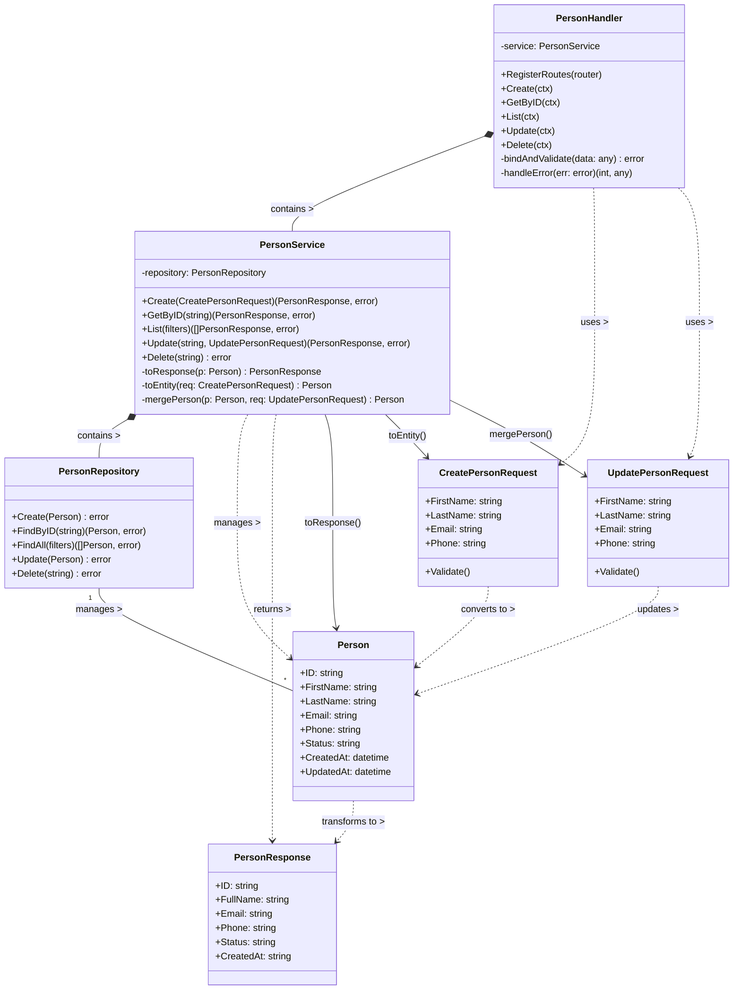

# Class Diagram - People Module (CertiTrack)

## Explicación del Diagrama (en español)

### Componentes Principales:

1. **Person**: Entidad principal que representa a una persona en el sistema.
2. **DTOs (Data Transfer Objects)**:
   - `CreatePersonRequest`: Para la creación de nuevas personas
   - `UpdatePersonRequest`: Para actualizaciones parciales
   - `PersonResponse`: Formato de respuesta de la API
3. **PersonRepository**: Maneja el acceso a la base de datos
4. **PersonService**: Contiene la lógica de negocio
5. **PersonHandler**: Maneja las peticiones HTTP (antes llamado Controller)

### Relaciones:

1. **Composición (◆)**:
   - `PersonHandler` contiene un `PersonService`
   - `PersonService` contiene un `PersonRepository`

2. **Dependencia (..>)**:
   - El handler usa los DTOs para validación
   - El servicio maneja las entidades y genera respuestas

3. **Asociación (--)**:
   - El repositorio gestiona múltiples instancias de `Person`

4. **Conversiones (..|>)**:
   - Los DTOs se convierten a entidades
   - Las entidades se transforman a respuestas

### Flujo de Datos:
1. Las peticiones HTTP llegan al `PersonHandler`
2. El handler valida los datos usando los DTOs
3. Delega la lógica al `PersonService`
4. El servicio convierte los DTOs a entidades
5. El repositorio persiste las entidades
6. Las entidades se transforman en respuestas
7. Las respuestas se devuelven al cliente
