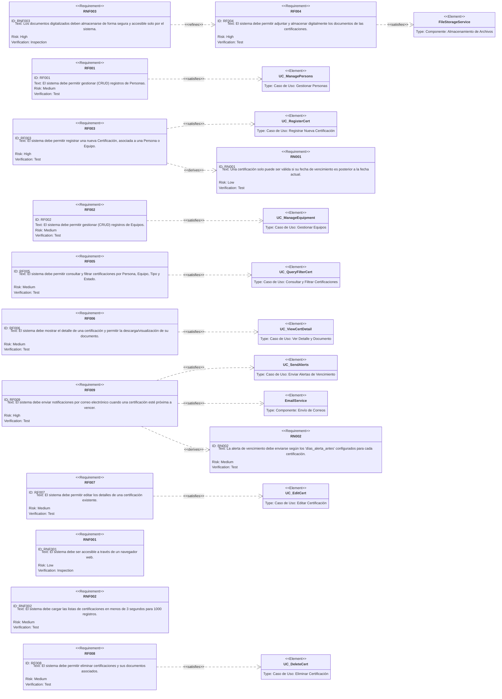

#Requerimientos

```mermaid
requirementDiagram

direction LR

requirement RF001 {
    id: "RF001"
    text: "El sistema debe permitir gestionar (CRUD) registros de Personas."
    risk: medium
    verifymethod: test
}
requirement RF002 {
    id: "RF002"
    text: "El sistema debe permitir gestionar (CRUD) registros de Equipos."
    risk: medium
    verifymethod: test
}
requirement RF003 {
    id: "RF003"
    text: "El sistema debe permitir registrar una nueva Certificación, asociada a una Persona o Equipo."
    risk: high
    verifymethod: test
}
requirement RF004 {
    id: "RF004"
    text: "El sistema debe permitir adjuntar y almacenar digitalmente los documentos de las certificaciones."
    risk: high
    verifymethod: test
}
requirement RF005 {
    id: "RF005"
    text: "El sistema debe permitir consultar y filtrar certificaciones por Persona, Equipo, Tipo y Estado."
    risk: medium
    verifymethod: test
}
requirement RF006 {
    id: "RF006"
    text: "El sistema debe mostrar el detalle de una certificación y permitir la descarga/visualización de su documento."
    risk: medium
    verifymethod: test
}
requirement RF007 {
    id: "RF007"
    text: "El sistema debe permitir editar los detalles de una certificación existente."
    risk: medium
    verifymethod: test
}
requirement RF008 {
    id: "RF008"
    text: "El sistema debe permitir eliminar certificaciones y sus documentos asociados."
    risk: medium
    verifymethod: test
}
requirement RF009 {
    id: "RF009"
    text: "El sistema debe enviar notificaciones por correo electrónico cuando una certificación esté próxima a vencer."
    risk: high
    verifymethod: test
}

requirement RNF001 {
    id: "RNF001"
    text: "El sistema debe ser accesible a través de un navegador web."
    risk: low
    verifymethod: inspection
}
requirement RNF002 {
    id: "RNF002"
    text: "El sistema debe cargar las listas de certificaciones en menos de 3 segundos para 1000 registros."
    risk: medium
    verifymethod: test
}
requirement RNF003 {
    id: "RNF003"
    text: "Los documentos digitalizados deben almacenarse de forma segura y accesible solo por el sistema."
    risk: high
    verifymethod: inspection
}

requirement RN001 {
    id: "RN001"
    text: "Una certificación solo puede ser válida si su fecha de vencimiento es posterior a la fecha actual."
    risk: low
    verifymethod: test
}
requirement RN002 {
    id: "RN002"
    text: "La alerta de vencimiento debe enviarse según los 'días_alerta_antes' configurados para cada certificación."
    risk: medium
    verifymethod: test
}

element UC_ManagePersons {
    type: "Caso de Uso: Gestionar Personas"
}
element UC_ManageEquipment {
    type: "Caso de Uso: Gestionar Equipos"
}
element UC_RegisterCert {
    type: "Caso de Uso: Registrar Nueva Certificación"
}
element UC_QueryFilterCert {
    type: "Caso de Uso: Consultar y Filtrar Certificaciones"
}
element UC_ViewCertDetail {
    type: "Caso de Uso: Ver Detalle y Documento"
}
element UC_EditCert {
    type: "Caso de Uso: Editar Certificación"
}
element UC_DeleteCert {
    type: "Caso de Uso: Eliminar Certificación"
}
element UC_SendAlerts {
    type: "Caso de Uso: Enviar Alertas de Vencimiento"
}
element FileStorageService {
    type: "Componente: Almacenamiento de Archivos"
}
element EmailService {
    type: "Componente: Envío de Correos"
}

RF001 -satisfies-> UC_ManagePersons
RF002 -satisfies-> UC_ManageEquipment
RF003 -satisfies-> UC_RegisterCert
RF004 -satisfies-> FileStorageService
RF005 -satisfies-> UC_QueryFilterCert
RF006 -satisfies-> UC_ViewCertDetail
RF007 -satisfies-> UC_EditCert
RF008 -satisfies-> UC_DeleteCert
RF009 -satisfies-> UC_SendAlerts
RF009 -satisfies-> EmailService

RF003 -derives-> RN001
RF009 -derives-> RN002
RNF003 -refines-> RF004
```